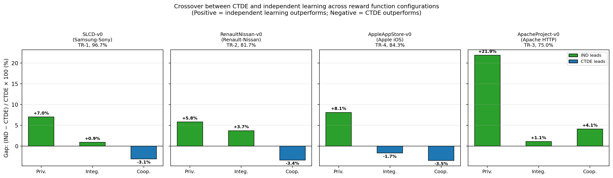

# Strategic Coopetition

[](https://github.com/vikpant/strategic-coopetition/actions/workflows/tests.yml)
[](https://github.com/vikpant/strategic-coopetition/actions/workflows/install.yml)
[](https://vikpant.github.io/strategic-coopetition/)
[](https://opensource.org/licenses/MIT)
[](https://www.python.org/)
[](https://github.com/vikpant/strategic-coopetition/discussions)

Computational techniques for modelling **strategic coopetition** (the
simultaneous pursuit of cooperation and competition) in mixed-motive
multi-agent environments. Bridges conceptual modelling, computational
game theory, and reinforcement learning.

<p align="center">
  
</p>

## At a glance

- **20 multi-agent environments** spanning four mechanism classes
  (interdependence, trust, collective action, reciprocity).
- **126-algorithm reference suite**: 16 training algorithms, 7
  game-theoretic oracles, 2 heuristics, and 101 constant-action policies.
- **Four validated case studies** calibrated to real-world coopetitive
  relationships: Samsung–Sony LCD (96.7%), Renault–Nissan (81.7%),
  Apache HTTP Server (86.7%), Apple iOS App Store (87.3%).
- **Reward-type ablation methodology** for mixed-motive evaluation,
  varying reward mutuality across private, integrated, and cooperative
  configurations while holding mechanism rules fixed.
- **Three-API design**: Gymnasium (single-agent style), PettingZoo
  Parallel (simultaneous moves), and PettingZoo AEC (sequential moves).

## Repository layout

| Folder | Contents |
|---|---|
| [`coopetition_gym/`](coopetition_gym/) | The Coopetition-Gym Python package, runnable [examples](coopetition_gym/examples/), a [reproducibility experiments](coopetition_gym/experiments/) tier, and library [extensions](coopetition_gym/extensions/). |
| [`TR_validation/`](TR_validation/) | Validation suites that reproduce the empirical results in the technical reports. |
| [`papers/`](papers/) | Per-paper artifact bundles. See [`papers/README.md`](papers/README.md). |

## Installation

```bash
git clone https://github.com/vikpant/strategic-coopetition.git
cd strategic-coopetition/coopetition_gym
pip install -e .
```

## Quickstart

```python
import coopetition_gym

env = coopetition_gym.make("TrustDilemma-v0")
obs, info = env.reset(seed=42)

for _ in range(100):
    obs, reward, terminated, truncated, info = env.step([60.0, 55.0])
    if terminated or truncated:
        break
```

A runnable Jupyter walkthrough lives at
[`coopetition_gym/examples/quickstart.ipynb`](coopetition_gym/examples/quickstart.ipynb).

## Documentation

The hosted documentation site is at
**<https://vikpant.github.io/strategic-coopetition/>** and is built
automatically from [`coopetition_gym/docs/`](coopetition_gym/docs/) on
every push to `master` by the
[`pages.yml`](.github/workflows/pages.yml) workflow. The site covers
installation, the API reference, the 20 environments, the evaluation
protocol, the four mechanism-class theory chapters, tutorials, and
troubleshooting.

## Cite us

If you use Coopetition-Gym in your research, please cite the relevant
technical report.

### Interdependence and complementarity (TR-1)

```bibtex
@article{pant2025interdependence,
  title   = {Computational Foundations for Strategic Coopetition:
             Formalizing Interdependence and Complementarity},
  author  = {Pant, Vik and Yu, Eric},
  journal = {arXiv preprint arXiv:2510.18802},
  year    = {2025}
}
```

### Trust and reputation dynamics (TR-2)

```bibtex
@article{pant2025trust,
  title   = {Computational Foundations for Strategic Coopetition:
             Formalizing Trust and Reputation Dynamics},
  author  = {Pant, Vik and Yu, Eric},
  journal = {arXiv preprint arXiv:2510.24909},
  year    = {2025}
}
```

### Collective action and loyalty (TR-3)

```bibtex
@article{pant2026collective,
  title   = {Computational Foundations for Strategic Coopetition:
             Formalizing Collective Action and Loyalty},
  author  = {Pant, Vik and Yu, Eric},
  journal = {arXiv preprint arXiv:2601.16237},
  year    = {2026}
}
```

### Sequential interaction and reciprocity (TR-4)

```bibtex
@article{pant2026reciprocity,
  title   = {Computational Foundations for Strategic Coopetition:
             Formalizing Sequential Interaction and Reciprocity},
  author  = {Pant, Vik and Yu, Eric},
  journal = {arXiv preprint arXiv:2604.01240},
  year    = {2026}
}
```

## Validated Case Studies

| Case study | Validation score | Technical report |
|---|---|---|
| Samsung–Sony S-LCD Joint Venture (2004–2011) | 58/60 (96.7%) | TR-1 §8 |
| Renault–Nissan Alliance (multi-phase) | 49/60 (81.7%) | TR-2 §9 |
| Apache HTTP Server community evolution | 52/60 (86.7%) | TR-3 §7 |
| Apple iOS App Store platform dynamics | 48/55 (87.3%) | TR-4 §8 |

## Community

Questions, ideas, and proposals are welcome on the project's
[GitHub Discussions](https://github.com/vikpant/strategic-coopetition/discussions)
board. Bug reports and feature requests should be filed via
[GitHub Issues](https://github.com/vikpant/strategic-coopetition/issues).

## Contributing

Contributions are welcome. See [CONTRIBUTING.md](CONTRIBUTING.md) and
the [Code of Conduct](CODE_OF_CONDUCT.md).

## License

MIT, see [LICENSE](LICENSE).

## Authors

**Vik Pant, PhD** ([LinkedIn](https://www.linkedin.com/in/vikpant) ·
[Google Scholar](https://scholar.google.com/citations?hl=en&user=eoKMjOMAAAAJ)) ·
**Eric Yu, PhD** · Faculty of Information, University of Toronto.
