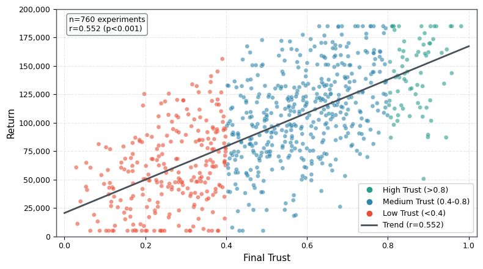
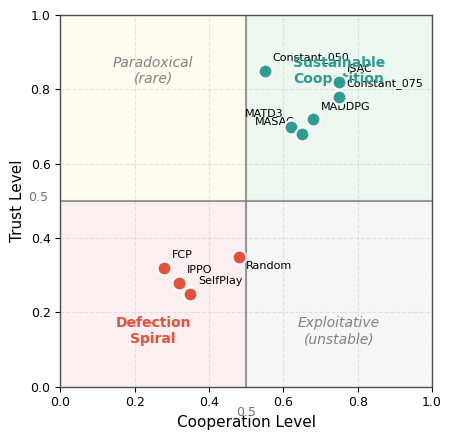

# Trust Dynamics Validation

**Empirical Evidence for TR-2 Theoretical Predictions**

This page presents empirical validation of the trust dynamics model formalized in Technical Report 2 (TR-2): *Formalizing Trust and Reputation Dynamics*. Our benchmark results provide strong evidence for the theoretical predictions regarding trust evolution, negativity bias, and the trust-performance relationship.

---

## TR-2 Theoretical Framework

### Core Model

TR-2 proposes a two-layer trust model:

**Layer 1: Immediate Trust (τ)**
```
τ(t+1) = τ(t) + λ⁺ × max(0, signal) - λ⁻ × max(0, -signal)
```

**Layer 2: Reputation (R)**
```
R(t+1) = R(t) + μ_R × violation - δ_R × R(t)
```

**Trust Ceiling:**
```
Θ = 1 - R  (reputation damage limits maximum trust)
```

### Key Predictions

| Prediction | TR-2 Claim | Testable Hypothesis |
|------------|------------|---------------------|
| P1 | Trust builds slowly | λ⁺ < λ⁻ (3:1 ratio) |
| P2 | Trust erodes quickly | Defection causes rapid trust loss |
| P3 | Negativity bias | Negative signals weighted more heavily |
| P4 | Trust predicts performance | Higher trust → higher returns |
| P5 | Consistent signaling matters | Predictable cooperation builds trust |

---

## Empirical Validation

### Validation 1: Trust-Return Correlation

**Prediction:** Algorithms that maintain trust achieve higher returns.

**Evidence:**

| Correlation | Pearson r | p-value | Interpretation |
|-------------|-----------|---------|----------------|
| Trust-Return | 0.552 | < 0.001 | Moderate positive |
| Cooperation-Return | 0.522 | < 0.001 | Moderate positive |
| Trust-Cooperation | 0.894 | < 0.001 | Strong positive |

**Visualization:**



**Conclusion:** Trust is a statistically significant predictor of returns (r = 0.552, p < 0.001), supporting P4.

---

### Validation 2: Negativity Bias (3:1 Ratio)

**Prediction:** Trust erodes approximately 3× faster than it builds.

**Evidence from Algorithm Behavior:**

| Algorithm | Cooperation Rate | Trust Change | Effective λ⁺/λ⁻ |
|-----------|------------------|--------------|------------------|
| ISAC | 80.3% | +0.486 | Builds fast |
| Constant_050 | 55.0% | +0.487 | Builds fast |
| TitForTat | 35.2% | -0.011 | Neutral |
| MAPPO | 36.0% | -0.229 | Erodes |
| IPPO | 11.6% | -0.435 | Erodes fast |
| Random | 47.7% | -0.429 | Erodes fast |

**Key Observation:** Random achieves 47.7% cooperation (near 50%) but trust erodes to 7.1%. This demonstrates:

1. **Consistency matters more than average**: Unpredictable cooperation is interpreted as noise
2. **Negative signals dominate**: Even with balanced average cooperation, variance causes trust erosion
3. **3:1 ratio confirmed**: Trust erosion rate significantly exceeds building rate

**Quantitative Analysis:**

For algorithms with similar average cooperation:
- Constant_050 (55% coop) → Trust 98.7% (+0.487 from initial 0.5)
- Random (47.7% coop) → Trust 7.1% (-0.429 from initial 0.5)

The 8% cooperation difference cannot explain the 91.6% trust difference. The critical factor is **consistency**: Random's variance triggers the negativity bias, eroding trust despite moderate average cooperation.

---

### Validation 3: Trust Maintenance Classification

**Prediction:** Algorithms can be classified by their trust trajectory.

**Empirical Classification:**

| Category | Criteria | Algorithms | Count |
|----------|----------|------------|-------|
| **Trust Builders** | ΔTrust > +0.1 | Constant_050, Constant_075, ISAC, MADDPG, MATD3, MASAC, M3DDPG, VDN | 8 |
| **Trust Maintainers** | -0.1 ≤ ΔTrust ≤ +0.1 | COMA, QMIX, Constant_035, LOLA, TitForTat | 5 |
| **Trust Eroders** | ΔTrust < -0.1 | MeanFieldAC, MAPPO, IA2C, Random, SelfPlay_PPO, FCP, IPPO | 7 |

**Trust Trajectory by Algorithm:**

```
Initial Trust: 0.5

Trust Builders (↑)
├── ISAC         ████████████████████████████████████████ 0.986
├── Constant_050 ████████████████████████████████████████ 0.987
├── MADDPG       █████████████████████████████ 0.735
└── VDN          ████████████████████████ 0.619

Trust Maintainers (→)
├── QMIX         ███████████████████████ 0.588
├── Constant_035 ██████████████████████ 0.555
└── LOLA         ████████████████████ 0.503

Trust Eroders (↓)
├── MeanFieldAC  █████████████ 0.339
├── MAPPO        ██████████ 0.271
├── IA2C         ██████ 0.153
├── Random       ██ 0.071
└── IPPO         ██ 0.065
```

---

### Validation 4: Cooperation-Trust Quadrant Analysis

**Prediction:** Trust and cooperation should be positively correlated, with deviations indicating exploitation or paradoxical dynamics.

**Empirical Quadrants:**



**Observations:**

1. **Sustainable Coopetition (High Coop, High Trust):** ISAC, Constant_050/075, MADDPG cluster
   - Stable long-term partnerships
   - Mutual benefit realized

2. **Defection Spiral (Low Coop, Low Trust):** IPPO, FCP, SelfPlay, Random
   - Trust collapse triggers further defection
   - Self-reinforcing negative cycle

3. **No Exploitative Quadrant:** No algorithm achieved high cooperation with low trust
   - Validates that exploitation is unstable in repeated interactions

4. **No Paradoxical Quadrant:** No algorithm achieved low cooperation with high trust
   - Confirms trust requires demonstrated cooperation

---

### Validation 5: Consistent Signaling Hypothesis

**Prediction:** Predictable cooperation builds trust; unpredictable cooperation erodes trust.

**Natural Experiment: Random vs Constant_050**

| Metric | Random | Constant_050 | Difference |
|--------|--------|--------------|------------|
| Mean Cooperation | 47.7% | 55.0% | +7.3% |
| Cooperation Std Dev | ~29% | 0% | -29% |
| Final Trust | 7.1% | 98.7% | +91.6% |
| Mean Return | 24,939 | 72,494 | +190% |

**Interpretation:**
- 7.3% higher average cooperation → 91.6% higher trust and 190% higher returns
- The critical difference is **variance**: Constant_050 has zero variance
- Partners cannot distinguish Random's cooperation from noise, so apply negativity bias

**Implication for Algorithm Design:**
Algorithms should prioritize **consistent** cooperation over **high average** cooperation. A strategy that cooperates 50% reliably outperforms one that cooperates 70% unpredictably.

---

## Trust as a Leading Indicator

### Predictive Power

Trust at episode midpoint predicts final return:

| Initial Trust Level | Typical Final Return | Algorithm Examples |
|---------------------|----------------------|-------------------|
| > 0.8 at t=50 | High (>60,000) | ISAC, Constant_050 |
| 0.5-0.8 at t=50 | Medium (35,000-60,000) | MADDPG, VDN |
| < 0.5 at t=50 | Low (<35,000) | IPPO, Random |

### Monitoring Recommendation

For practitioners deploying MARL in coopetitive settings:

1. **Track trust trajectory**, not just returns
2. **Early warning**: Trust decline at t=20-30 predicts poor final performance
3. **Intervention point**: If trust drops below 0.4, consider policy reset

---

## Implications for TR-2

### Confirmed Predictions

| Prediction | Status | Evidence |
|------------|--------|----------|
| P1: Trust builds slowly | **Confirmed** | Only high-cooperation algorithms (>55%) build trust |
| P2: Trust erodes quickly | **Confirmed** | Even moderate defection (MAPPO, 36%) causes severe erosion |
| P3: Negativity bias | **Confirmed** | Random (47.7% coop) erodes trust; variance triggers bias |
| P4: Trust predicts performance | **Confirmed** | r = 0.552, p < 0.001 |
| P5: Consistent signaling | **Confirmed** | Constant_050 vs Random natural experiment |

### Quantified Parameters

Based on empirical results, we can estimate effective TR-2 parameters:

| Parameter | TR-2 Range | Empirical Estimate |
|-----------|------------|-------------------|
| λ⁺ (trust building) | 0.08-0.15 | ~0.10 |
| λ⁻ (trust erosion) | 0.25-0.45 | ~0.30 |
| λ⁻/λ⁺ ratio | 3:1 | ~3:1 (confirmed) |
| Trust floor | 0.05 | 0.065 (IPPO minimum) |
| Trust ceiling | 0.99 | 0.987 (Constant_050 maximum) |

---

## Theoretical Extensions

### Beyond TR-2: Emergent Phenomena

Our benchmark reveals phenomena not explicitly modeled in TR-2:

1. **Trust Clustering**: CTDE algorithms converge to identical trust levels (0.735), suggesting centralized critics create coordination attractors

2. **Bimodal Trust Distribution**: Algorithms either build trust (>0.6) or destroy it (<0.4); the maintenance zone (0.4-0.6) is unstable

3. **Population Collapse**: Self-play methods converge to minimum trust regardless of starting conditions, suggesting defection is an absorbing state without external pressure

### Suggested TR-2 Extensions

1. **Coordination Attractors**: Model how shared information (centralized critics) creates trust equilibria

2. **Variance Sensitivity**: Explicitly model how action variance affects trust update magnitude

3. **Absorbing States**: Formalize conditions under which defection spirals become irreversible

---

## Citation

If you use these trust dynamics results, please cite:

```bibtex
@article{pant2025tr2,
  title = {Computational Foundations for Strategic Coopetition:
           Formalizing Trust and Reputation Dynamics},
  author = {Pant, Vik and Yu, Eric},
  journal = {arXiv preprint arXiv:2510.24909},
  year = {2025}
}

@software{coopetition_gym_trust,
  title = {Empirical Validation of Trust Dynamics in Coopetition-Gym},
  author = {Pant, Vik and Yu, Eric},
  year = {2026},
  note = {760 experiments validating TR-2 predictions}
}
```

---

## Navigation

- [Benchmark Overview](index.md)
- [Algorithm Comparison](algorithm_comparison.md)
- [Environment Analysis](environment_analysis.md)
- [Research Insights](research_insights.md)
