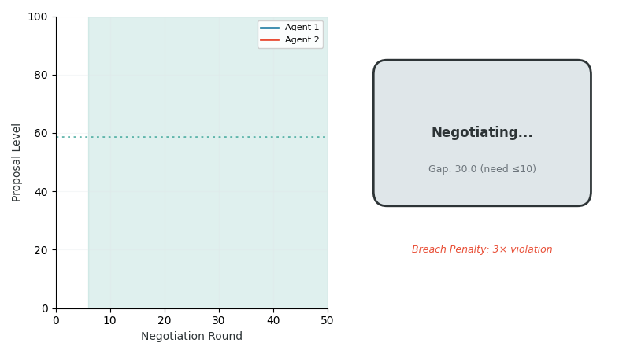

# CooperativeNegotiation-v0

**Category:** Extended Environment
**Agents:** 2
**Difficulty:** Advanced
**Source:** `coopetition_gym/envs/extended_envs.py`

---

## Overview

CooperativeNegotiation-v0 implements a **multi-round negotiation** environment with explicit commitment mechanics. Agents submit proposals that, when aligned, form binding agreements. Violating these agreements incurs significant penalties.

This environment tests:
1. **Communication through actions**: Signaling intentions via proposals
2. **Trust building**: Establishing credibility through consistency
3. **Commitment and enforcement**: Understanding contract dynamics
4. **Breach penalties**: Learning consequences of defection


*Left: Proposal convergence as agents adjust positions toward agreement. Right: Agreement status timeline showing negotiation (blue), agreement (green), and breach (red) phases with 3× penalty multiplier.*

---

## MARL Classification

| Property | Value |
|----------|-------|
| **Game Type** | Markov Game with endogenous commitment (contract formation) |
| **Cooperation Structure** | Mixed-Motive with enforceable agreements |
| **Observability** | Full (including agreement status and terms) |
| **Communication** | Implicit proposals (actions encode offers) + explicit agreements |
| **Agent Symmetry** | Symmetric |
| **Reward Structure** | Mixed + breach penalties (3× multiplier on violations) |
| **Action Space** | Continuous: A_i = [0, 100] (proposals/commitments) |
| **State Dynamics** | Deterministic with discrete agreement transitions |
| **Horizon** | Finite, T = 100 |
| **Canonical Comparison** | Contract games with commitment; cf. Crawford & Sobel (1982), Raiffa (1982) negotiation theory |

---

## Formal Specification

This environment is formalized as a 2-player Markov Game with **endogenous agreement formation**.

### Agents
**N** = {1, 2} (symmetric negotiators)

| Property | Value |
|----------|-------|
| Endowment | 100.0 |
| Baseline | 35.0 |
| Bargaining α | 0.50 |

### State Space
**S** ⊆ ℝ¹⁸ (extended with agreement info)

| Component | Dimension | Description |
|-----------|-----------|-------------|
| Standard State | 15 | Actions, trust, reputation, interdependence, time |
| Agreement Levels | 2 | Agreed cooperation levels (or -1 if no agreement) |
| Has Agreement | 1 | Boolean flag (0 or 1) |

### Action Space
**A**_i = [0, 100] ⊂ ℝ representing either:
- **Pre-agreement**: Proposal for cooperation level
- **Post-agreement**: Actual cooperation level (subject to breach detection)

### Agreement Formation

**Agreement condition**: Proposals converge within threshold
```
|a_1 - a_2| ≤ agreement_threshold (default: 10.0)
```

When agreement forms:
```
agreed_level = (a_1 + a_2) / 2
```

### Breach Detection

Post-agreement, deviations trigger penalties:
```
if |a_i - agreed_level_i| > agreement_threshold:
    breach_penalty = breach_multiplier × |a_i - agreed_level_i|
    r_i = r_i - breach_penalty
```

where breach_multiplier = 3.0 (default).

### Trust Parameters

| Parameter | Symbol | Value | Note |
|-----------|--------|-------|------|
| Trust Building | λ⁺ | 0.12 | Faster (agreement builds trust) |
| Trust Erosion | λ⁻ | 0.40 | High (breach penalty) |
| Reputation Damage | $\mu_R$ | 0.65 | Strong (breach = reputation damage) |
| Reputation Decay | $\delta_R$ | 0.02 | Standard |

### Reward Function

```
r_i = π_i + 0.55 · π_j - breach_penalty_i
```

Breach penalty makes defection costly post-agreement.

### Episode Structure

- **Horizon**: T = 100 steps
- **Truncation**: t ≥ T
- **Termination**: mean(τ) < 0.05
- **Discount**: γ = 1.0

### Initial State
- τ_ij(0) = 0.50 (neutral)
- R_ij(0) = 0.00
- has_agreement = False
- agreed_levels = None

---

## Game-Theoretic Background

### Negotiation Theory

Real-world negotiations involve:
- **Proposal exchange**: Parties state positions
- **Convergence**: Moving toward mutual agreement
- **Commitment**: Agreeing to specific terms
- **Enforcement**: Penalties for violation

### The Commitment Problem

Without commitment mechanisms:
- Agreements are cheap talk
- Defection is tempting post-agreement
- Trust is hard to establish

With commitment mechanisms:
- Agreements become credible
- Breach penalties align incentives
- Trust can be built through consistency

---

## Environment Specification

### Basic Usage

```python
import coopetition_gym
import numpy as np

env = coopetition_gym.make("CooperativeNegotiation-v0")
obs, info = env.reset(seed=42)

for step in range(100):
    # Actions are proposals/commitments
    agent_0_proposal = 55.0  # Propose 55% cooperation
    agent_1_proposal = 52.0  # Propose 52% cooperation

    actions = np.array([agent_0_proposal, agent_1_proposal])
    obs, rewards, terminated, truncated, info = env.step(actions)

    if info['agreement_reached']:
        print(f"Agreement reached at step {step}!")
        print(f"Agreed levels: {info['current_agreement']}")
```

### Parameters

| Parameter | Default | Description |
|-----------|---------|-------------|
| `max_steps` | 100 | Maximum timesteps |
| `agreement_threshold` | 10.0 | Max proposal difference for agreement |
| `breach_penalty_multiplier` | 3.0 | Penalty for violating agreement |
| `negotiation_rounds` | 5 | Rounds before commitment (unused in current) |
| `render_mode` | None | Rendering mode |

---

## Agreement Mechanics

### Reaching Agreement

An agreement is reached when proposals are close:

```python
proposal_diff = abs(action_0 - action_1)
if proposal_diff <= agreement_threshold:
    agreement_reached = True
    agreed_level = (action_0 + action_1) / 2  # Average
```

### Agreement State

Once an agreement is reached:
- **Agreed levels** are recorded
- **Subsequent actions** are compared to agreement
- **Deviations** trigger breach penalties

### Breach Detection

```python
if has_agreement:
    for agent in [0, 1]:
        deviation = abs(action[agent] - agreement[agent])
        if deviation > agreement_threshold:
            breach_occurred = True
            penalty = breach_penalty_multiplier * deviation
            rewards[agent] -= penalty
```

---

## Observation Space

### Extended Observation

| Component | Shape | Description |
|-----------|-------|-------------|
| Standard | 15 | Actions, trust, rep, interdep, step |
| Agreement Levels | 2 | Agreed cooperation levels (or -1) |
| Has Agreement | 1 | Boolean flag |

**Total dimension**: 18

### Agreement Information in Observation

```python
# Check agreement status from observation
has_agreement = obs[-1] > 0.5  # Last element is flag
if has_agreement:
    agreed_levels = obs[-3:-1]  # Second-to-last elements
```

---

## Reward Structure

### Base Rewards

Standard integrated utility (see TrustDilemma-v0).

### Breach Penalty

When an agent deviates from agreement:

```
penalty = breach_penalty_multiplier × |action - agreed_level|
reward = base_reward - penalty
```

With multiplier = 3.0:
- Deviation of 10 units → penalty of 30
- Deviation of 20 units → penalty of 60

This makes breach very costly.

---

## Trust Dynamics

### Parameters

| Parameter | Symbol | Value | Description |
|-----------|--------|-------|-------------|
| Trust Building Rate | λ⁺ | 0.12 | Moderate building |
| Trust Erosion Rate | λ⁻ | 0.40 | High erosion (breach penalty) |
| Reputation Damage | $\mu_R$ | 0.65 | Strong reputation effects |
| Reputation Decay | $\delta_R$ | 0.02 | Standard decay |
| Interdependence Amp. | ξ | 0.55 | Moderate amplification |
| Signal Sensitivity | κ | 1.2 | Enhanced sensitivity |
| Initial Trust | τ₀ | 0.50 | Neutral start |

### Breach Impact on Trust

Breaching an agreement:
1. Triggers trust erosion (high λ⁻)
2. Adds reputation damage (high $\mu_R$)
3. Affects future interactions

---

## Metrics and Info

The `info` dictionary includes:

| Key | Type | Description |
|-----|------|-------------|
| `step` | int | Current timestep |
| `agreement_reached` | bool | Whether agreement exists |
| `current_agreement` | tuple | Agreed levels (or None) |
| `breach_occurred` | bool | Whether breach this step |
| `total_agreements` | int | Cumulative agreements |
| `total_breaches` | int | Cumulative breaches |
| `proposal_convergence` | float | 1 - (diff / 100) |

---

## Strategic Analysis

### Negotiation Strategies

**Gradual Convergence:**
- Start with moderate proposals
- Adjust based on partner's response
- Converge to mutually acceptable level

**Aggressive Opening:**
- Start with favorable proposal
- See if partner concedes
- Risk: may delay agreement

**Matching Strategy:**
- Mirror partner's proposal
- Signal willingness to agree
- Quick convergence but may not optimize

### Post-Agreement Strategies

**Honor Commitment:**
- Match agreed level exactly
- Build trust for future negotiations
- Avoid all penalties

**Minor Deviation:**
- Small deviation under threshold
- No penalty but trust impact
- Short-term gain possible

**Major Breach:**
- Large deviation exceeding threshold
- Severe penalty
- Trust collapses

---

## Example: Negotiation Protocol

```python
import coopetition_gym
import numpy as np

env = coopetition_gym.make("CooperativeNegotiation-v0")
obs, info = env.reset(seed=42)

# Negotiation state
my_proposal = 60.0
partner_last = 50.0

for step in range(100):
    # Simple convergence: move toward partner
    if not info.get('agreement_reached', False):
        # Negotiation phase: move toward partner
        my_proposal = 0.7 * my_proposal + 0.3 * partner_last
    else:
        # Agreement phase: honor commitment
        my_proposal = info['current_agreement'][0]

    # Partner uses similar logic (simulated)
    partner_proposal = 0.6 * partner_last + 0.4 * my_proposal

    actions = np.array([my_proposal, partner_proposal])
    obs, rewards, terminated, truncated, info = env.step(actions)

    partner_last = obs[1]  # Partner's last action

    if step == 20:
        print(f"Step 20: Agreement={info['agreement_reached']}, "
              f"Proposals=({my_proposal:.1f}, {partner_proposal:.1f})")

print(f"\nFinal: {info['total_agreements']} agreements, "
      f"{info['total_breaches']} breaches")
```

---

## Research Applications

CooperativeNegotiation-v0 is suitable for studying:

- **Contract Theory**: Commitment and enforcement
- **Negotiation**: Multi-round bargaining dynamics
- **Communication**: Signaling through actions
- **Institutional Design**: Agreement mechanisms
- **MARL with Commitments**: Learning with binding agreements

---

## Related Environments

- [TrustDilemma-v0](trust_dilemma.md): Without explicit contracts
- [PartnerHoldUp-v0](partner_holdup.md): Power-asymmetric negotiation
- [ReputationMarket-v0](reputation_market.md): Market-level agreements

---

## References

1. Crawford, V.P. & Sobel, J. (1982). Strategic Information Transmission. Econometrica.
2. Raiffa, H. (1982). The Art and Science of Negotiation. Harvard University Press.
3. Pant, V. & Yu, E. (2025). [Computational Foundations for Strategic Coopetition: Formalizing Trust and Reputation Dynamics](https://arxiv.org/abs/2510.24909). arXiv:2510.24909
