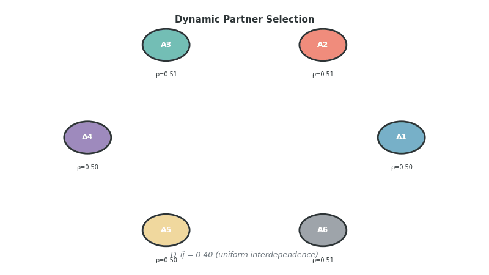

# DynamicPartnerSelection-v0

**Category:** Ecosystem Environment
**Agents:** N (configurable)
**Difficulty:** Advanced
**Source:** `coopetition_gym/envs/ecosystem_envs.py`

---

## Overview

DynamicPartnerSelection-v0 models a **marketplace** where N agents observe public reputation scores and form partnerships dynamically. This environment captures scenarios like freelance markets, academic collaborations, and business-to-business matching.

The key challenge is learning to:
1. **Interpret reputation signals** as indicators of partner quality
2. **Maintain own reputation** to attract high-quality partners
3. **Navigate social learning dynamics** in a multi-agent setting


*Six-agent marketplace with evolving public reputations. Node size indicates reputation score, edge color shows pairwise trust levels (green=high, red=low). Cooperation builds reputation and attracts quality partners.*

---

## MARL Classification

| Property | Value |
|----------|-------|
| **Game Type** | Markov Game (N-player, general-sum); Mean-Field Game approximation for large N |
| **Cooperation Structure** | Mixed-Motive with reputation externalities (cooperation builds public reputation) |
| **Observability** | Full state + public reputation scores (extended observation) |
| **Communication** | Implicit (actions + public reputation signals) |
| **Agent Symmetry** | Symmetric (homogeneous agents with equal endowments and dependencies) |
| **Reward Structure** | Mixed with uniform interdependence (D_ij = 0.40 for all i≠j) |
| **Action Space** | Continuous: A_i = [0, 100] for all agents |
| **State Dynamics** | Deterministic |
| **Horizon** | Finite, T = 50 steps |
| **Canonical Comparison** | Reputation games; cf. Resnick & Zeckhauser (2002), rating systems in matching markets |

---

## Formal Specification

This environment is formalized as an N-player symmetric Markov Game with public reputation signals.

### Agents
**N** = {1, ..., n} where n = n_agents (default 6), all symmetric:

| Property | Value | Description |
|----------|-------|-------------|
| Endowment | 100.0 | Equal for all agents |
| Baseline | 35.0 | 35% cooperation threshold |
| Bargaining α | 1/N | Equal surplus sharing |

### State Space
**S** ⊆ ℝ^d where d = N + 3N² + 1 + N (standard state + reputation vector)

| Component | Dimension | Description |
|-----------|-----------|-------------|
| Actions | N | Previous cooperation levels |
| Trust Matrix | N² | Pairwise trust τ_ij |
| Reputation Damage | N² | Reputation damage R_ij |
| Interdependence | N² | Uniform dependencies D_ij = 0.40 |
| Timestep | 1 | Normalized t/T |
| **Public Reputations** | N | Global reputation scores ρ_i ∈ [0,1] |

**Total dimension**: d = N + 3N² + 1 + N = 4N² + 2N + 1

### Action Space
For each agent i ∈ {1, ..., N}:

**A**_i = [0, 100] ⊂ ℝ

### Interdependence Matrix (Fully Connected)

```
D_ij = 0.40 for all i ≠ j
D_ii = 0.00
```

All agents value each other's outcomes equally—no preferential partnerships.

### Reputation Dynamics

**Public Reputation Update** (exponential moving average):
```
ρ_i(t+1) = 0.9 · ρ_i(t) + 0.1 · (a_i(t) / e_i)
```

Properties:
- ρ_i ∈ [0, 1] (normalized cooperation history)
- Persistence parameter α = 0.9 (slow adaptation)
- Publicly observable by all agents

### Reward Function

Standard integrated utility with symmetric weights:
```
r_i = π_i + 0.40 · Σ_{j≠i} π_j
```

Value function uses $\theta = 18.0$, $\gamma = 0.55$ (moderate complementarity).

### Episode Structure

- **Horizon**: T = 50 steps
- **Truncation**: t ≥ T
- **Termination**: None (no early termination)
- **Discount**: γ = 1.0

### Initial State
- τ_ij(0) = 0.50 (neutral trust)
- R_ij(0) = 0.00
- ρ_i(0) = 0.50 (neutral reputation)

---

## Game-Theoretic Background

### Reputation-Based Matching

In many real markets:
- Past behavior is publicly observable (ratings, reviews, track records)
- Reputation affects future opportunities
- Agents must balance short-term gains against reputation

### The Reputation Investment Problem

**Short-term incentive**: Free-ride on current reputation by defecting

**Long-term incentive**: Maintain or build reputation for:
- Access to better partners
- Higher value partnerships
- Competitive advantage

### Social Learning Dynamics

Agents learn from observing:
- Their own outcomes with partners
- Public reputation changes
- Market-level cooperation patterns

---

## Environment Specification

### Basic Usage

```python
import coopetition_gym
import numpy as np

# Create environment with 6 agents (default)
env = coopetition_gym.make("DynamicPartnerSelection-v0")

# Or customize
env = coopetition_gym.make("DynamicPartnerSelection-v0", n_agents=8)

obs, info = env.reset(seed=42)

# Run episode
for step in range(50):
    # All agents choose cooperation levels
    actions = np.random.uniform(40, 70, size=env.n_agents)
    obs, rewards, terminated, truncated, info = env.step(actions)

print(f"Reputation ranking: {info['reputation_ranking']}")
```

### Parameters

| Parameter | Default | Description |
|-----------|---------|-------------|
| `n_agents` | 6 | Number of agents in marketplace |
| `max_steps` | 50 | Maximum timesteps per episode |
| `reputation_weight` | 0.5 | How much reputation affects compatibility |
| `render_mode` | None | Rendering mode |

---

## Agent Configuration

### Endowments

All agents have equal endowment:
- **Endowment**: 100.0 for each agent

### Bargaining Shares

Equal bargaining power:
- **Alpha**: 1.0/N for each agent

### Interdependence

Fully connected graph with uniform dependencies:

```
D[i,j] = 0.40 for all i ≠ j
D[i,i] = 0.00
```

All agents value each other's outcomes equally.

---

## Reputation System

### Global Reputation Scores

Each agent maintains a public reputation score in [0, 1]:

```python
# Initial reputation
reputations = [0.5] * n_agents  # All start at 0.5

# Update after each step
for i, agent in enumerate(agents):
    coop_score = actions[i] / endowments[i]  # [0, 1]
    reputations[i] = 0.9 * reputations[i] + 0.1 * coop_score
```

### Reputation Properties

1. **Persistence**: Exponential moving average (α = 0.1)
2. **Observable**: Included in extended observation space
3. **Bounded**: Clamped to [0, 1]
4. **Episode persistence**: Can carry across episodes (optional)

### Resetting Reputation

```python
# Reset reputation at episode start
obs, info = env.reset(options={"reset_reputation": True})

# Keep reputation from previous episode
obs, info = env.reset(options={"reset_reputation": False})
```

---

## Observation Space

### Extended Observation

The observation includes standard components plus reputation:

| Component | Shape | Description |
|-----------|-------|-------------|
| Standard | N + 3N² + 1 | Actions, trust, reputation damage, interdependence, step |
| Reputation | N | Public reputation scores |

**Total dimension**: Base + N

### Reputation Observation

Agents can see all other agents' reputations:

```python
obs[-n_agents:]  # Reputation scores for all agents
```

---

## Trust Dynamics

### Parameters

| Parameter | Symbol | Value | Description |
|-----------|--------|-------|-------------|
| Trust Building Rate | λ⁺ | 0.12 | Moderate building |
| Trust Erosion Rate | λ⁻ | 0.35 | Standard erosion |
| Reputation Damage | μ_R | 0.60 | Strong reputation effects |
| Reputation Decay | δ_R | 0.015 | Very slow forgetting |
| Interdependence Amp. | ξ | 0.45 | Moderate amplification |
| Signal Sensitivity | κ | 1.2 | Moderate sensitivity |
| Initial Trust | τ₀ | 0.50 | Neutral start |

### Reputation-Trust Interaction

High reputation leads to:
- Faster trust building with new partners
- Higher initial trust in new relationships
- Buffer against trust erosion

---

## Value Function

### Parameters

| Parameter | Value | Description |
|-----------|-------|-------------|
| θ | 18.0 | Moderate logarithmic scale |
| γ | 0.55 | Moderate complementarity |

---

## Metrics and Info

The `info` dictionary includes:

| Key | Type | Description |
|-----|------|-------------|
| `step` | int | Current timestep |
| `public_reputations` | ndarray | All agents' reputations |
| `reputation_ranking` | list | Agents sorted by reputation (descending) |
| `mean_reputation` | float | Market average reputation |
| `reputation_std` | float | Reputation inequality measure |
| `mean_cooperation` | float | Average cooperation level |

---

## Strategic Analysis

### Reputation Investment Strategies

**Build Reputation Early:**
- Cooperate heavily in initial steps
- Establish high reputation for later benefits
- Front-load costs for back-loaded returns

**Maintain Reputation:**
- Cooperate enough to preserve current level
- Balance investment against returns
- Sustainable steady-state strategy

**Exploit Reputation:**
- Build reputation then defect
- Cash in on established trust
- Risky if market has memory

### Partner Selection Logic

Agents implicitly "select" partners through action levels:
- High cooperation → signal desire for partnership
- Low cooperation → signal distrust or exit
- Reputation affects expected partner quality

### Equilibrium Dynamics

In equilibrium:
- High-reputation agents match with each other
- Low-reputation agents face adverse selection
- Stratification emerges naturally

---

## Example: Reputation-Based Strategy

```python
import coopetition_gym
import numpy as np

env = coopetition_gym.make("DynamicPartnerSelection-v0", n_agents=6)
obs, info = env.reset(seed=42, options={"reset_reputation": True})

# Track my reputation (agent 0)
my_reputation_history = []

for step in range(50):
    # Strategy: Cooperate proportionally to own reputation
    # High reputation -> maintain it; Low -> build it
    my_rep = info['public_reputations'][0]

    if my_rep < 0.6:
        # Build reputation
        my_action = 80.0  # 80% cooperation
    else:
        # Maintain with moderate cooperation
        my_action = 60.0  # 60% cooperation

    # Other agents: Random strategies
    other_actions = np.random.uniform(30, 70, size=5)

    actions = np.concatenate([[my_action], other_actions])
    obs, rewards, terminated, truncated, info = env.step(actions)

    my_reputation_history.append(info['public_reputations'][0])

print(f"Final reputation: {my_reputation_history[-1]:.3f}")
print(f"My rank: {info['reputation_ranking'].index(0) + 1} of 6")
```

---

## Research Applications

DynamicPartnerSelection-v0 is suitable for studying:

- **Reputation Systems**: Design and dynamics
- **Social Learning**: Learning from public signals
- **Market Design**: Matching market mechanisms
- **Strategic Signaling**: Reputation as signal
- **Multi-Agent RL**: Coordination in large populations

---

## Related Environments

- [ReputationMarket-v0](reputation_market.md): Tiered reputation effects
- [PlatformEcosystem-v0](platform_ecosystem.md): Platform-mediated matching
- [TrustDilemma-v0](trust_dilemma.md): Dyadic trust building

---

## References

1. Resnick, P. & Zeckhauser, R. (2002). Trust Among Strangers in Internet Transactions. Advances in Applied Microeconomics.
2. Dellarocas, C. (2003). The Digitization of Word of Mouth. Management Science.
3. Pant, V. & Yu, E. (2025). [Computational Foundations for Strategic Coopetition: Formalizing Trust and Reputation Dynamics](https://arxiv.org/abs/2510.24909). arXiv:2510.24909
