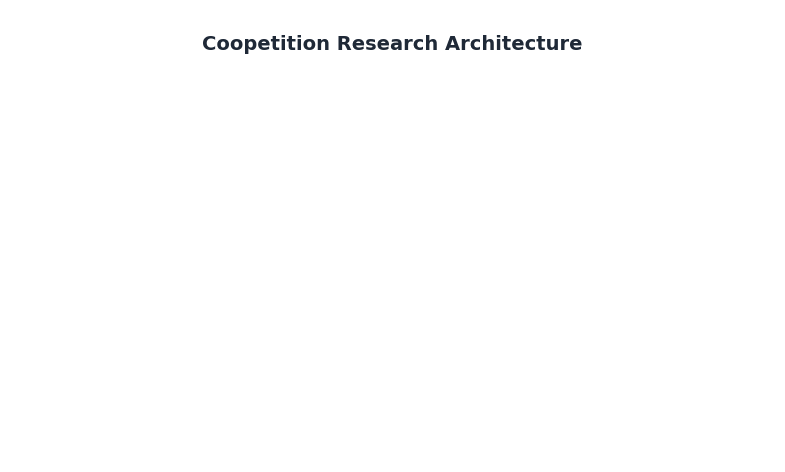

# Theoretical Foundations

**Mathematical Framework for Computational Coopetition**

This section provides comprehensive documentation of the theoretical foundations underlying Coopetition-Gym, derived from the published technical reports on computational foundations for strategic coopetition.

---

## Overview

Coopetition-Gym implements a mathematically rigorous framework bridging two traditions:

1. **Conceptual Modeling** (i* Framework): Rich qualitative representations of strategic dependencies and actor relationships
2. **Game Theory**: Precise quantitative analysis of strategic interactions and equilibrium behavior

The synthesis produces environments where:
- Structural dependencies from organizational analysis inform utility functions
- Trust dynamics evolve based on observed behavior
- Equilibrium analysis incorporates interdependence and complementarity
- Parameters are validated against real business partnerships

### Research Program Architecture



*Four-pillar research program: Pillars 1 & 2 are implemented, Pillars 3 & 4 are planned.*

---

## Research Program Structure

The theoretical foundations are organized into four pillars, of which **Pillars 1 and 2** are currently implemented:

### Implemented Pillars

| Pillar | Technical Report | Focus | Status |
|--------|-----------------|-------|--------|
| **1** | [TR-2025-01](https://arxiv.org/abs/2510.18802) | Interdependence & Complementarity | ✓ Implemented |
| **2** | [TR-2025-02](https://arxiv.org/abs/2510.24909) | Trust & Reputation Dynamics | ✓ Implemented |

### Planned Pillars

| Pillar | Technical Report | Focus | Status |
|--------|-----------------|-------|--------|
| **3** | TR-2025-03 (Draft) | Team Production & Loyalty | Planned |
| **4** | TR-2025-04 (Draft) | Sequential Interaction & Reciprocity | Planned |

See [Implementation Roadmap](../roadmap.md) for development timeline and planned features.

---

## Theory Documentation

### Core Mathematical Framework

| Document | Content | Audience |
|----------|---------|----------|
| [Interdependence Framework](interdependence.md) | Structural dependencies, i* translation, D matrix | Researchers, Advanced Users |
| [Value Creation & Complementarity](value_creation.md) | Value functions, synergy, superadditivity | Researchers, Economists |
| [Trust Dynamics](trust_dynamics.md) | Two-layer trust, asymmetric updating, hysteresis | Researchers, Behavioral Scientists |
| [Parameter Reference](parameters.md) | Validated values, calibration guidance | All Users |

### Quick Reference

**For Practitioners** seeking to use the environments:
- Start with [Parameter Reference](parameters.md) for recommended values
- Review [Quick Start](../tutorials/quickstart.md) for implementation patterns

**For Researchers** seeking to extend the framework:
- Study [Interdependence Framework](interdependence.md) for Pillar 1 foundations
- Study [Trust Dynamics](trust_dynamics.md) for Pillar 2 foundations
- Review original technical reports for complete proofs and derivations

---

## Mathematical Notation

The following notation is used consistently throughout the documentation:

### Indices and Sets

| Symbol | Definition |
|--------|------------|
| N | Number of agents |
| i, j ∈ {1, ..., N} | Agent indices |
| t ∈ {0, 1, 2, ...} | Time period |
| d ∈ D_i | Dependum (goal, task, resource) in agent i's goal set |

### Actions and Payoffs

| Symbol | Definition | Range |
|--------|------------|-------|
| a_i | Agent i's action (cooperation/investment level) | [0, e_i] |
| **a** = (a_1, ..., a_N) | Action profile (all agents) | ∏[0, e_i] |
| e_i | Agent i's endowment | ℝ⁺ |
| π_i(**a**) | Agent i's private payoff | ℝ |
| U_i(**a**) | Agent i's integrated utility | ℝ |

### Interdependence (Pillar 1)

| Symbol | Definition | Range |
|--------|------------|-------|
| D_ij | Interdependence coefficient (i depends on j) | [0, 1] |
| w_d | Importance weight of dependum d | ℝ⁺ |
| Dep(i,j,d) | Dependency indicator (binary) | {0, 1} |
| crit(i,j,d) | Criticality factor | [0, 1] |
| **D** | Interdependence matrix | [0,1]^(N×N) |

### Value Functions (Pillar 1)

| Symbol | Definition | Range |
|--------|------------|-------|
| V(**a**\|γ) | Total value created | ℝ⁺ |
| f_i(a_i) | Individual value contribution | ℝ⁺ |
| g(a_1, ..., a_N) | Synergy function | ℝ⁺ |
| γ | Complementarity parameter | [0, 1] |
| θ | Logarithmic scale parameter | ℝ⁺ |
| β | Power function exponent | (0, 1) |
| α_i | Agent i's share of synergistic value | [0, 1] |

### Trust Dynamics (Pillar 2)

| Symbol | Definition | Range |
|--------|------------|-------|
| T_ij^t | Immediate trust (i toward j at time t) | [0, 1] |
| R_ij^t | Reputation damage (j's violations from i's view) | [0, 1] |
| Θ_ij^t | Trust ceiling | [0, 1] |
| s_ij^t | Cooperation signal | (-1, 1) |
| λ⁺ | Trust building rate | (0, 1) |
| λ⁻ | Trust erosion rate | (0, 1) |
| μ_R | Reputation damage severity | (0, 1) |
| δ_R | Reputation decay rate | (0, 1) |
| ξ | Interdependence amplification factor | [0, 1] |
| κ | Signal sensitivity | ℝ⁺ |

---

## Core Equations Summary

### Pillar 1: Interdependence & Complementarity

**Interdependence Matrix** (Equation 1, TR-1):
```
D_ij = Σ(w_d × Dep(i,j,d) × crit(i,j,d)) / Σw_d
```

**Value Creation** (Equation 2, TR-1):
```
V(a|γ) = Σ f_i(a_i) + γ × g(a_1, ..., a_N)
```

**Logarithmic Individual Value** (Equation 6, TR-1):
```
f_i(a_i) = θ × ln(1 + a_i)    where θ = 20.0
```

**Power Individual Value** (Equation 3, TR-1):
```
f_i(a_i) = a_i^β              where β = 0.75
```

**Geometric Mean Synergy** (Equation 4, TR-1):
```
g(a_1, ..., a_N) = (a_1 × a_2 × ... × a_N)^(1/N)
```

**Private Payoff** (Equation 11, TR-1):
```
π_i(a) = e_i - a_i + f_i(a_i) + α_i × [V(a) - Σf_j(a_j)]
```

**Integrated Utility** (Equation 13, TR-1):
```
U_i(a) = π_i(a) + Σ D_ij × π_j(a)
```

### Pillar 2: Trust Dynamics

**Cooperation Signal** (Equation 4, TR-2):
```
s_ij^t = tanh(κ × (a_j^t - a_j^baseline))
```

**Trust Evolution** (Equation 5, TR-2):
```
T_ij^(t+1) = T_ij^t + ΔT_ij^t

where:
  ΔT = λ⁺ × s × (Θ - T)           if s > 0  (building)
  ΔT = -λ⁻ × |s| × T × (1 + ξD_ij) if s ≤ 0  (erosion)
```

**Trust Ceiling** (Equation 7, TR-2):
```
Θ_ij^t = 1 - R_ij^t
```

**Reputation Evolution** (Equation 8, TR-2):
```
R_ij^(t+1) = R_ij^t + ΔR_ij^t - δ_R × R_ij^t

where:
  ΔR = μ_R × |s| × (1 - R)    if s < 0  (damage)
  ΔR = 0                       if s ≥ 0  (no damage)
```

---

## Validation Methodology

The framework employs **dual-track validation**:

### Track 1: Experimental Robustness

Systematic parameter sweeps ensure phenomena emerge robustly:

| Validation Set | Configurations | Purpose |
|----------------|----------------|---------|
| TR-1 Validation | 22,000+ trials | Value function robustness |
| TR-2 Validation | 78,125 configs | Trust dynamics robustness |
| Benchmark Suite | 760 experiments | Algorithm performance |

### Track 2: Empirical Case Studies

Real-world validation against documented business partnerships:

| Case Study | Period | Validation Score | Dynamics Validated |
|------------|--------|------------------|-------------------|
| Samsung-Sony S-LCD | 2004-2011 | 58/60 (96.7%) | Interdependence, complementarity |
| Renault-Nissan Alliance | 1999-2025 | 49/60 (81.7%) | Trust evolution, crisis, recovery |

### Statistical Significance

| Metric | Value | Interpretation |
|--------|-------|----------------|
| p-value | < 0.001 | Highly significant |
| Cohen's d | 9.87 | Very large effect size |
| Negativity Ratio | 3.0 median | Consistent with behavioral economics |

---

## Theoretical Assumptions

The framework makes the following key assumptions:

### Rationality Assumptions

1. **Bounded Rationality**: Agents optimize utility but with limited information
2. **Forward-Looking**: Agents consider future consequences (discount factor β ≈ 0.95)
3. **Observable Actions**: Cooperation levels are observable (no hidden actions)

### Structural Assumptions

1. **Asymmetric Dependencies**: D_ij ≠ D_ji in general
2. **Stable Structure**: Interdependence matrix D is fixed within episodes
3. **Continuous Actions**: Cooperation levels are continuous, not discrete

### Trust Assumptions

1. **Negativity Bias**: Trust erodes faster than it builds (λ⁻ > λ⁺)
2. **Path Dependence**: Historical violations constrain future trust (hysteresis)
3. **Bilateral Trust**: T_ij ≠ T_ji (trust is not automatically symmetric)

### Limitations

1. **No Communication**: Agents cannot explicitly signal intentions
2. **No Contracting**: No binding commitment mechanisms (Pillar 4 addresses this)
3. **Homogeneous Agents**: Within-agent-type homogeneity assumed
4. **Western Business Context**: Validated primarily on Western partnerships

---

## Citation

If you use the theoretical framework in your research, please cite:

```bibtex
@article{pant2025tr1,
  title={Computational Foundations for Strategic Coopetition:
         Formalizing Interdependence and Complementarity},
  author={Pant, Vik and Yu, Eric},
  journal={arXiv preprint arXiv:2510.18802},
  year={2025}
}

@article{pant2025tr2,
  title={Computational Foundations for Strategic Coopetition:
         Formalizing Trust and Reputation Dynamics},
  author={Pant, Vik and Yu, Eric},
  journal={arXiv preprint arXiv:2510.24909},
  year={2025}
}
```

---

## Navigation

### Theory Documents
- [Interdependence Framework](interdependence.md)
- [Value Creation & Complementarity](value_creation.md)
- [Trust Dynamics](trust_dynamics.md)
- [Parameter Reference](parameters.md)

### Related Documentation
- [Documentation Home](../index.md)
- [Implementation Roadmap](../roadmap.md)
- [Environment Reference](../environments/index.md)
- [Benchmark Results](../benchmarks/index.md)
