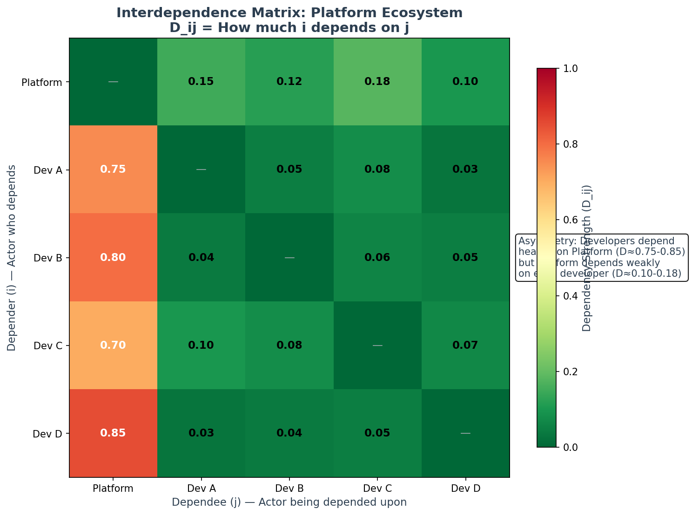

# Interdependence Framework

**Formalizing Structural Dependencies for Strategic Coopetition (TR-1)**

This document provides a comprehensive treatment of the interdependence formalization from Technical Report 1 (TR-2025-01), explaining how structural dependencies from conceptual models translate to quantitative game-theoretic analysis.

---

## Interdependence at a Glance



*Example interdependence matrix for a platform ecosystem. Notice the asymmetry: developers depend heavily on the platform (D ≈ 0.75-0.85) while the platform has only moderate dependency on any single developer (D ≈ 0.10-0.18).*

---

## Executive Summary

**For Practitioners**: Interdependence captures *why* actors must consider partner outcomes even while competing. When your success depends on your partner's success, you have rational incentive to care about their performance—not from altruism, but from structural necessity.

**For Researchers**: We formalize interdependence through translation from i* dependency networks to an interdependence matrix D, where D_ij ∈ [0,1] quantifies the structural coupling of actor i's outcomes to actor j's actions. This enables game-theoretic equilibrium analysis with dependency-augmented utility functions.

---

## Conceptual Foundation

### The Interdependence Problem

Classical game theory assumes purely self-interested payoffs: each actor maximizes their own returns without intrinsic concern for others. This fails to capture a fundamental aspect of real organizational relationships:

**Structural Dependency Creates Rational Concern for Partner Outcomes**

When Actor A depends on Actor B for critical resources, capabilities, or goal achievement:
- A's success *structurally requires* B's success
- A has *rational incentive* to care about B's performance
- This concern is *instrumental*, not altruistic

**Example**: A startup developing for iOS cannot succeed if Apple's App Store fails. The startup rationally cares about Apple's platform health—not from goodwill, but because their business depends on it.

### Distinguishing Interdependence from Altruism

| Concept | Source | Motivation | Varies With |
|---------|--------|------------|-------------|
| **Interdependence** | Structural coupling | Instrumental self-interest | Dependency structure |
| **Altruism** | Psychological preference | Concern for others' welfare | Personal values |
| **Reciprocity** | Behavioral response | Conditional cooperation | Partner behavior |

Interdependence is **structural**: it emerges from how goals and capabilities connect, not from psychological disposition. Two actors with identical personalities will have different interdependence coefficients based on their positions in the dependency network.

---

## The i* Framework Foundation

### Strategic Dependency Modeling

The i* framework (Yu, 1995) provides the conceptual basis for interdependence analysis through its representation of strategic actors and dependencies.

**Core Elements**:

| Element | Symbol | Definition |
|---------|--------|------------|
| Actor | Circle | Intentional entity with goals |
| Depender | i | Actor who depends |
| Dependee | j | Actor who is depended upon |
| Dependum | d | Object of dependency (goal, task, resource) |

**Dependency Relationship**: When Actor i depends on Actor j for dependum d, this creates a structural constraint: i cannot fully achieve certain goals without j's successful performance in delivering d.

### Example: Platform Ecosystem

```
┌─────────────────────────────────────────────────────────────────┐
│                    i* DEPENDENCY NETWORK                        │
│                                                                 │
│     ┌──────────┐                          ┌──────────┐          │
│     │ Platform │                          │Developer │          │
│     │ Provider │                          │   App    │          │
│     └────┬─────┘                          └────┬─────┘          │
│          │                                     │                │
│          │ depends on                          │ depends on     │
│          │ (user engagement)                   │ (API access)   │
│          ▼                                     ▼                │
│     ┌──────────┐                          ┌──────────┐          │
│     │Developer │                          │ Platform │          │
│     │   App    │                          │ Provider │          │
│     └──────────┘                          └──────────┘          │
│                                                                 │
│     D_platform,developer = 0.35    D_developer,platform = 0.80  │
│     (moderate)                     (high)                       │
└─────────────────────────────────────────────────────────────────┘
```

**Asymmetry**: The developer critically depends on the platform (D = 0.80), while the platform moderately depends on any single developer (D = 0.35). This asymmetry has profound strategic implications.

---

## Mathematical Formalization

### The Interdependence Matrix

**Definition**: The interdependence matrix **D** is an N×N matrix where element D_ij ∈ [0,1] quantifies the structural dependency of actor i on actor j.

### Equation 1: Interdependence Coefficient

```
D_ij = Σ(w_d × Dep(i,j,d) × crit(i,j,d)) / Σw_d
```

**Components**:

| Component | Symbol | Range | Meaning |
|-----------|--------|-------|---------|
| Importance Weight | w_d | ℝ⁺ | Strategic priority of goal d for actor i |
| Dependency Indicator | Dep(i,j,d) | {0, 1} | Does i depend on j for d? |
| Criticality Factor | crit(i,j,d) | [0, 1] | How critical is j for achieving d? |

### Computing Each Component

#### Importance Weights (w_d)

**Purpose**: Quantify the strategic priority of each goal/dependum for the actor.

**Elicitation Methods**:

1. **Analytic Hierarchy Process (AHP)**:
   - Pairwise comparison of goals
   - Eigenvalue analysis produces priority vector
   - Mathematically rigorous, stakeholder-validated

2. **Direct Assessment**:
   - Allocate 100 points across goals
   - Simple, fast, intuitive
   - May lack consistency guarantees

3. **Goal Criticality Analysis**:
   - Rate goals on urgency, impact, stakeholder priority
   - Composite scoring
   - Comprehensive but complex

**Example**:
```
Developer Goals:
  - Revenue generation: w = 0.50 (highest priority)
  - User acquisition: w = 0.30
  - Technical capability: w = 0.20

Σw = 1.00 (normalized)
```

#### Dependency Indicator (Dep(i,j,d))

**Purpose**: Binary flag indicating whether a dependency relationship exists.

**Determination**: Direct from i* model analysis
- Dep(i,j,d) = 1 if there is a dependency link from i to j for d
- Dep(i,j,d) = 0 otherwise

**Example**:
```
Developer depends on Platform for:
  - API access: Dep = 1 (critical dependency)
  - App distribution: Dep = 1 (critical dependency)
  - Marketing support: Dep = 0 (developer does own marketing)
```

#### Criticality Factor (crit(i,j,d))

**Purpose**: Quantify how essential actor j is for achieving dependum d.

**Calculation Rules**:

| Scenario | crit(i,j,d) | Rationale |
|----------|-------------|-----------|
| Sole provider, no alternatives | 1.0 | Complete criticality |
| n equal alternatives | 1/n | Distributed criticality |
| Preferred but substitutable | [1/n, 1] | Partial lock-in |
| Fully substitutable | 0.1-0.3 | Minimal switching cost |

**Example**:
```
Developer criticality for Platform API:
  - Only one platform available: crit = 1.0
  - Two platforms (iOS, Android): crit = 0.5 per platform
  - Developer prefers iOS but could switch: crit = 0.65 for iOS
```

### Worked Example: Computing D_ij

**Scenario**: Developer's dependency on Platform

| Goal (d) | w_d | Dep | crit | w × Dep × crit |
|----------|-----|-----|------|----------------|
| Revenue | 0.50 | 1 | 0.90 | 0.450 |
| Users | 0.30 | 1 | 0.85 | 0.255 |
| Tech | 0.20 | 1 | 0.60 | 0.120 |
| **Total** | **1.00** | | | **0.825** |

```
D_developer,platform = 0.825 / 1.00 = 0.825
```

**Interpretation**: The developer's outcomes are 82.5% dependent on the platform's performance. This is a high-dependency relationship creating significant strategic exposure.

---

## Properties of the Interdependence Matrix

### Structural Properties

| Property | Description | Implication |
|----------|-------------|-------------|
| Bounded | D_ij ∈ [0, 1] | Normalized interpretation |
| Asymmetric | D_ij ≠ D_ji generally | Power imbalances |
| Zero diagonal | D_ii = 0 | No self-dependency |
| Non-negative | D_ij ≥ 0 | Dependencies cannot be negative |

### Interpretive Guidelines

| D_ij Value | Interpretation | Strategic Implications |
|------------|----------------|------------------------|
| 0.00 | No dependency | Independent operation |
| 0.01 - 0.20 | Minimal dependency | Low strategic coupling |
| 0.20 - 0.40 | Moderate dependency | Some coordination needed |
| 0.40 - 0.60 | Significant dependency | Strategic partnership |
| 0.60 - 0.80 | High dependency | Critical relationship |
| 0.80 - 1.00 | Near-complete dependency | Survival depends on partner |

### Dependency Patterns

**Mutual High Dependency** (D_ij ≈ D_ji, both high):
- Strong structural incentive for cooperation
- "Married" partners with aligned interests
- Example: Joint venture with balanced contributions

**Asymmetric Dependency** (D_ij >> D_ji):
- Power imbalance favoring actor j
- Actor i vulnerable to exploitation
- Example: Small supplier to dominant buyer

**Low Mutual Dependency** (D_ij ≈ D_ji ≈ 0):
- Arms-length relationship
- Pure competition possible
- Example: Competitors in separate markets

---

## Integration with Utility Functions

### The Integrated Utility Function

The interdependence matrix enters the utility function as weights on partner payoffs:

**Equation 13 (TR-1)**:
```
U_i(a) = π_i(a) + Σ D_ij × π_j(a)
```

**Components**:

| Term | Meaning |
|------|---------|
| π_i(a) | Actor i's private payoff |
| D_ij × π_j(a) | Dependency-weighted concern for j's payoff |
| Σ D_ij × π_j(a) | Total structural concern for all partners |

### Why This Works

The integrated utility captures rational self-interest in the presence of structural coupling:

1. **When D_ij = 0**: U_i = π_i (pure self-interest)
2. **When D_ij > 0**: U_i includes weighted partner payoffs
3. **Higher D_ij**: More weight on partner's success

This is **not** altruism—it's recognizing that when your outcomes depend on your partner's performance, maximizing your utility requires considering their payoffs.

### Coopetitive Equilibrium

**Definition**: A Coopetitive Equilibrium is a Nash Equilibrium where each actor maximizes the integrated utility function:

```
a* is Coopetitive Equilibrium if:
  a_i* ∈ argmax U_i(a_i, a_{-i}*) for all i
```

**Key Insight**: Coopetitive Equilibrium generally produces more cooperative outcomes than standard Nash Equilibrium because the integrated utility includes positive spillovers through interdependence terms.

---

## Translation Framework

### Step-by-Step Process

**Step 1: Elicit the i* Dependency Network**
- Identify actors and their boundaries
- Map goals for each actor
- Document dependency relationships (depender → dependee for dependum)

**Step 2: Quantify Importance Weights**
- Use AHP, direct assessment, or criticality analysis
- Normalize weights to sum to 1.0
- Document rationale for traceability

**Step 3: Assess Criticality Factors**
- Identify alternative providers for each dependency
- Calculate criticality based on substitutability
- Consider switching costs and lock-in effects

**Step 4: Compute Interdependence Matrix**
- Apply Equation 1 for each (i, j) pair
- Verify D_ii = 0 and D_ij ∈ [0, 1]
- Check for expected asymmetries

**Step 5: Validate and Refine**
- Compare to stakeholder intuitions
- Run sensitivity analysis on key parameters
- Iterate as needed

### Iterative Refinement

The translation process is inherently iterative:

```
┌─────────────────┐      ┌─────────────────┐
│   i* Conceptual │ ◄──► │  Computational  │
│      Model      │      │     Model       │
└────────┬────────┘      └────────┬────────┘
         │                        │
         │    Quantification      │
         │    reveals gaps        │
         │◄───────────────────────┤
         │                        │
         │    Equilibrium analysis│
         │    suggests new        │
         ├───────────────────────►│
         │    dependencies        │
         │                        │
         ▼                        ▼
┌─────────────────────────────────────────┐
│          Refined Understanding          │
└─────────────────────────────────────────┘
```

---

## Validation: Samsung-Sony S-LCD Case Study

### Case Background

**Joint Venture**: Samsung and Sony formed S-LCD Corporation (2004-2011) to manufacture LCD panels.

**Key Dynamics**:
- Samsung provided manufacturing expertise
- Sony provided brand and market access
- Both depended on joint venture for panel supply
- Competition continued in downstream TV markets

### Interdependence Analysis

**Estimated D Matrix**:
```
           Samsung  Sony
Samsung  [  0.00   0.45 ]
Sony     [  0.40   0.00 ]
```

**Interpretation**:
- Moderate mutual dependency (0.40-0.45)
- Near-symmetric relationship
- Both had alternative options (Samsung: in-house capability; Sony: other suppliers)
- Neither completely dependent

### Validation Results

| Metric | Model Prediction | Historical Data | Match |
|--------|------------------|-----------------|-------|
| Cooperation level | 41% increase | 15-50% range | ✓ |
| Relationship duration | 7-8 years | 8 years | ✓ |
| Eventual dissolution | Predicted | Occurred 2012 | ✓ |

**Validation Score**: 58/60 criteria matched (96.7%)

---

## Practical Applications

### For Requirements Engineering

- **Stakeholder Analysis**: Quantify dependencies to identify critical stakeholders
- **Risk Assessment**: High D_ij indicates vulnerability to partner failure
- **Negotiation Preparation**: Understand power balance before negotiations

### For Alliance Management

- **Partner Selection**: Seek moderate mutual dependency for balanced relationships
- **Contract Design**: Structure agreements reflecting interdependence structure
- **Performance Monitoring**: Track D-matrix evolution over time

### For MARL Research

- **Environment Design**: Use D matrix to create realistic interdependence structures
- **Algorithm Evaluation**: Test whether algorithms discover cooperative equilibria
- **Mechanism Design**: Adjust D to study incentive effects

---

## Common Pitfalls

### Pitfall 1: Confusing Dependency with Preference

**Wrong**: "We like working with them, so D is high"
**Right**: D reflects structural necessity, not preference

### Pitfall 2: Assuming Symmetry

**Wrong**: "If I depend on them, they depend on me equally"
**Right**: D_ij and D_ji are independent; asymmetry is common

### Pitfall 3: Static Analysis

**Wrong**: "Compute D once and use forever"
**Right**: D should be updated as relationships evolve

### Pitfall 4: Over-Precision

**Wrong**: "D_ij = 0.4237 exactly"
**Right**: D estimates have uncertainty; use sensitivity analysis

---

## Further Reading

### Primary Source
- Pant, V. & Yu, E. (2025). Computational Foundations for Strategic Coopetition: Formalizing Interdependence and Complementarity. *arXiv:2510.18802*

### Background
- Yu, E. (1995). Modelling Strategic Relationships for Process Reengineering. *PhD Thesis, University of Toronto*
- Brandenburger, A. & Nalebuff, B. (1996). Co-opetition. *Currency Doubleday*

### Related Theory Documents
- [Value Creation & Complementarity](value_creation.md)
- [Trust Dynamics](trust_dynamics.md)
- [Parameter Reference](parameters.md)

---

## Navigation

- [Theoretical Foundations](index.md)
- [Value Creation & Complementarity](value_creation.md)
- [Trust Dynamics](trust_dynamics.md)
- [Parameter Reference](parameters.md)
- [Environment Reference](../environments/index.md)
