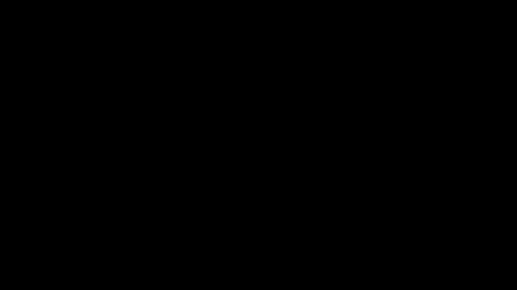

# Trust Dynamics

**Formalizing Trust and Reputation Evolution in Strategic Coopetition (TR-2)**

This document provides a comprehensive treatment of trust dynamics from Technical Report 2 (TR-2025-02), explaining how trust evolves through repeated interactions and how it affects strategic behavior.

---

## Trust Evolution at a Glance


*Two-layer trust model animation showing cooperation periods (green background), defection periods (red background), trust trajectory (blue), and trust ceiling Θ = 1 - R (dashed red). Notice how trust builds slowly during cooperation but erodes rapidly during defection—the 3:1 negativity bias.*

---

## Executive Summary

**For Practitioners**: Trust is not static—it evolves based on observed behavior. A single betrayal can destroy years of trust-building, but consistent cooperation slowly rebuilds confidence. Understanding these dynamics is essential for managing long-term partnerships.

**For Researchers**: We formalize trust as a two-layer dynamic system: immediate trust (T) responds to current behavior while reputation damage (R) tracks violation history. Asymmetric updating (3:1 negativity bias) and trust ceiling mechanisms create path-dependent dynamics validated against the Renault-Nissan Alliance.

---

## Conceptual Foundation

### Why Trust Matters in Coopetition

In coopetitive relationships, actors face ongoing temptation to defect—to capture short-term gains at the partner's expense. Trust addresses this by:

1. **Enabling Cooperation**: High trust reduces perceived exploitation risk
2. **Gating Information Sharing**: Actors share more with trusted partners
3. **Supporting Long-Horizon Planning**: Trust enables commitment to joint investments
4. **Creating Relationship Value**: Trusted partnerships are more productive

### The Trust Evolution Challenge

Trust is inherently dynamic:
- **Builds slowly** through consistent cooperative behavior
- **Erodes quickly** through violations or perceived betrayals
- **Creates path dependence**: History constrains future possibilities
- **Exhibits hysteresis**: Damaged relationships cannot fully recover

Classical game theory lacks mechanisms for this dynamic evolution. Our formalization addresses this gap.

### Distinguishing Trust Concepts

| Concept | Definition | Our Formalization |
|---------|------------|-------------------|
| **Immediate Trust** | Current confidence in partner | $T_{ij} \in [0, 1]$ |
| **Reputation** | Historical track record | $R_{ij} \in [0, 1]$ (damage) |
| **Trustworthiness** | Actual reliability | Not modeled (observable only through signals) |
| **Trust Ceiling** | Maximum achievable trust | $\Theta = 1 - R$ |

---

## Two-Layer Trust Architecture

### Layer 1: Immediate Trust ($T_{ij}$)

**Definition**: Actor $i$'s current confidence in actor $j$'s reliability and cooperative intent.

**Properties**:
- Range: $T_{ij} \in [0, 1]$
- Responsive to recent behavior
- Can increase (trust building) or decrease (trust erosion)
- Constrained by trust ceiling $\Theta$

**Interpretation**:

| T Value | Interpretation | Behavioral Implication |
|---------|----------------|------------------------|
| 0.0 - 0.2 | No trust | Expect defection; protect self |
| 0.2 - 0.4 | Low trust | Cautious engagement; verify behavior |
| 0.4 - 0.6 | Moderate trust | Willing to cooperate with monitoring |
| 0.6 - 0.8 | High trust | Confident cooperation; share information |
| 0.8 - 1.0 | Full trust | Deep partnership; strategic alignment |

### Layer 2: Reputation Damage ($R_{ij}$)

**Definition**: Accumulated history of actor $j$'s violations from actor $i$'s perspective.

**Properties**:
- Range: $R_{ij} \in [0, 1]$ where 0 = pristine, 1 = completely damaged
- Accumulates through violations
- Decays slowly over time (forgetting)
- Creates permanent limits on trust recovery

**Interpretation**:

| R Value | Interpretation | Trust Ceiling (Θ) |
|---------|----------------|-------------------|
| 0.00 | No violation history | 1.00 (full recovery possible) |
| 0.20 | Minor past issues | 0.80 |
| 0.40 | Significant violations | 0.60 |
| 0.60 | Severe damage | 0.40 |
| 0.80 | Major betrayals | 0.20 |
| 1.00 | Complete destruction | 0.00 (trust impossible) |

### The Trust Ceiling Mechanism

**Equation 7 (TR-2)**:

$$\Large \Theta_{ij}^t = 1 - R_{ij}^t$$

The trust ceiling creates **hysteresis**: even perfect cooperation cannot restore trust beyond this limit.

**Example Trajectory**:
```
Initial state: T=0.50, R=0.00, Θ=1.00
After violation: T=0.30, R=0.40, Θ=0.60
After 10 periods cooperation: T→0.58 (cannot exceed 0.60)
After 50 periods cooperation: T→0.60 max (ceiling reached)
```

The relationship can improve but will always bear the scar of past violations.

---

## Cooperation Signal

### Assessing Partner Behavior

To update trust, actors assess whether partners are cooperating or defecting. This requires comparing observed behavior to expectations.

**Equation 4 (TR-2)**: Cooperation Signal

$$\Large s_{ij}^t = \tanh\left(\kappa \cdot (a_j^t - a_j^{\text{baseline}})\right)$$

**Components**:

| Component | Meaning | Typical Value |
|-----------|---------|---------------|
| $a_j$ | Actor $j$'s actual action | Observed cooperation level |
| $a_j^{\text{baseline}}$ | Expected cooperation | Context-dependent norm |
| $\kappa$ | Signal sensitivity | 1.0 (default) |
| $s_{ij}$ | Cooperation signal | $\in (-1, 1)$ |

### Signal Interpretation

| s Value | Interpretation | Trust Effect |
|---------|----------------|--------------|
| s > 0.5 | Strong positive signal | Rapid trust building |
| 0 < s < 0.5 | Mild cooperation | Gradual trust building |
| s ≈ 0 | Met expectations | Neutral (slight positive) |
| -0.5 < s < 0 | Mild defection | Gradual trust erosion |
| s < -0.5 | Strong violation | Rapid trust erosion |

### Why Bounded (tanh)?

The hyperbolic tangent function ensures:
1. **Bounded signals**: Even extreme deviations produce finite trust changes
2. **Smooth transitions**: No discontinuities in trust dynamics
3. **Diminishing sensitivity**: Very large deviations don't dominate

### Baseline Elicitation

The baseline $a_j^{\text{baseline}}$ is context-specific:

| Context | Baseline Determination |
|---------|------------------------|
| Contractual | Agreed-upon cooperation levels |
| Historical | Moving average of past behavior |
| Normative | Industry/organizational standards |
| Rational | Nash equilibrium prediction |

---

## Asymmetric Trust Evolution

### The Negativity Bias

Trust evolution is fundamentally asymmetric: violations hurt more than cooperation helps.



*Demonstration of the 3:1 negativity bias: three cooperative events (①②③) build trust gradually, but a single defection event (④) erases comparable gains. The bar chart comparison shows the ratio is approximately 3:1—matching behavioral economics research.*

**Equation 5 (TR-2)**: Trust Change

$$
\Delta T_{ij}^t = \begin{cases}
\lambda^+ \cdot s_{ij}^t \cdot (\Theta_{ij}^t - T_{ij}^t) & \text{if } s_{ij}^t > 0 \text{ (building)} \\[8pt]
-\lambda^- \cdot |s_{ij}^t| \cdot T_{ij}^t \cdot (1 + \xi \cdot D_{ij}) & \text{if } s_{ij}^t \leq 0 \text{ (erosion)}
\end{cases}
$$

### Trust Building ($s > 0$)

$$\Large \Delta T = \lambda^+ \cdot s \cdot (\Theta - T)$$

**Components**:
- $\lambda^+ = 0.10$ (validated building rate)
- $s$: Positive cooperation signal
- $(\Theta - T)$: Available space below ceiling

**Properties**:
- Building slows as trust approaches ceiling
- Cannot exceed ceiling (Θ)
- Positive feedback: cooperation → trust → more cooperation

### Trust Erosion ($s \leq 0$)

$$\Large \Delta T = -\lambda^- \cdot |s| \cdot T \cdot (1 + \xi \cdot D_{ij})$$

**Components**:
- $\lambda^- = 0.30$ (validated erosion rate)
- $|s|$: Magnitude of violation signal
- $T$: Current trust level (more to lose when trust is high)
- $(1 + \xi \cdot D_{ij})$: Interdependence amplification

**Properties**:
- Erosion is faster than building (λ⁻ > λ⁺)
- High-trust relationships fall harder (proportional to T)
- High-dependency relationships hurt more (amplification)

### The 3:1 Ratio

**Validated Finding**: Trust erodes approximately 3× faster than it builds.

$$\Large \text{Negativity Ratio} = \frac{\lambda^-}{\lambda^+} = \frac{0.30}{0.10} = 3.0$$

**Empirical Grounding**: This ratio aligns with behavioral economics research on negativity bias (Rozin & Royzman, 2001; Slovic, 1993):
- Negative events are weighted more heavily in judgment
- Trust is evolutionarily costly to give (vulnerability)
- Violations signal potential future harm

### Interdependence Amplification

**Equation Component**: $(1 + \xi \cdot D_{ij})$

When actor $i$ depends heavily on actor $j$ (high $D_{ij}$), violations by $j$ cause amplified trust damage:

$$\Large \text{Amplification factor} = 1 + \xi \cdot D_{ij}$$

| Dependency Level | $D_{ij}$ | Amplification Factor |
|------------------|----------|---------------------|
| Low dependency | 0.2 | 1.10 |
| High dependency | 0.8 | 1.40 |

**Intuition**: Betrayal by someone you depend on hurts more because:
1. Direct goal impact (structural coupling)
2. Limited alternatives (can't easily switch)
3. Psychological salience (greater attention to critical dependencies)

**Benchmark Evidence**: High-dependency relationships experience 27% faster trust erosion for equivalent violations.

---

## Reputation Dynamics

### Reputation Damage Accumulation

**Equation 8 (TR-2)**: Reputation Change

$$\Large R_{ij}^{t+1} = R_{ij}^t + \Delta R_{ij}^t - \delta_R \cdot R_{ij}^t$$

**Damage Term**:

$$
\Delta R_{ij}^t = \begin{cases}
\mu_R \cdot |s_{ij}^t| \cdot (1 - R_{ij}^t) & \text{if } s_{ij}^t < 0 \text{ (violation)} \\[8pt]
0 & \text{if } s_{ij}^t \geq 0 \text{ (no damage)}
\end{cases}
$$

### Parameters

| Parameter | Symbol | Validated Value | Meaning |
|-----------|--------|-----------------|---------|
| Damage Severity | $\mu_R$ | 0.60 | How much damage per violation |
| Decay Rate | $\delta_R$ | 0.03 | Forgetting rate per period |

### Damage Mechanics

- $\mu_R \cdot |s|$: Proportional to violation severity
- $(1 - R)$: Available damage space (cannot exceed 1.0)
- $\delta_R \cdot R$: Gradual forgetting over time

### Forgetting Dynamics

Reputation decays slowly even without new violations:

$$\Large R(t) = R_0 \cdot (1 - \delta_R)^t$$

**Time to decay from $R=0.50$ to $R=0.25$ (half-life)**:
- $0.25 = 0.50 \times 0.97^t$
- $t \approx 23$ periods

With $\delta_R = 0.03$, forgetting is slow—violations leave lasting marks.

---

## Trust-Performance Relationship

### Benchmark Validation

From 760 experiments across 20 algorithms:

**Trust-Return Correlation**: r = 0.552 (p < 0.001)

```
Return vs Final Trust (760 experiments)

180,000 |                                    ○
        |                               ○  ○○○
140,000 |                          ○○ ○○○○○○
        |                      ○○○○○○○○○
100,000 |                  ○○○○○○○○○
        |              ○○○○○○○○○
 60,000 |          ○○○○○○○○○
        |      ○○○○○○○○
 20,000 | ○○○○○○○
        |_______________________________________
         0.0   0.2   0.4   0.6   0.8   1.0
                    Final Trust
```

### Algorithm Performance by Trust

| Trust Category | Algorithm Examples | Mean Return |
|----------------|-------------------|-------------|
| High Trust (>0.8) | Constant_050, ISAC | 72,494 |
| Medium Trust (0.4-0.8) | MADDPG, VDN | 50,903 |
| Low Trust (<0.4) | IPPO, SelfPlay_PPO | 21,019 |

### The Constant_050 vs Random Natural Experiment

| Metric | Random | Constant_050 | Insight |
|--------|--------|--------------|---------|
| Mean Cooperation | 47.7% | 55.0% | +7.3% |
| Cooperation Variance | ~29% | 0% | -29% |
| Final Trust | 7.1% | 98.7% | +91.6% |
| Mean Return | 24,939 | 72,494 | +190% |

**Critical Insight**: Constant_050's superior performance comes from **consistency**, not higher average cooperation. Unpredictable cooperation triggers negativity bias, eroding trust despite moderate average behavior.

---

## Hysteresis and Path Dependence

### What is Hysteresis?

Hysteresis means the system's state depends on its history, not just current inputs. In trust:

- A relationship that was damaged cannot return to its original state
- The path to current trust level matters, not just the level itself
- Future possibilities are constrained by past violations

### Formal Characterization

**Trust Ceiling**:

$$\Large \Theta(t) = 1 - R(t)$$

For any trajectory with violations:

$$\Large \max[T(t \to \infty)] = \Theta < 1.0$$

Even infinite cooperation cannot restore trust to pre-violation levels.

### Recovery Dynamics

**Validated Finding** (TR-2 §7.3): Median recovery ratio = 1.11

After 35 periods of sustained cooperation following a violation:
- Trust reaches ~111% of pre-violation level
- BUT: Without violation, trust would have reached ~98%
- **Net shortfall**: ~9% permanent damage

### Practical Implications

1. **Prevention over cure**: Avoiding violations is more efficient than recovering
2. **Reputation management**: Long-term reputation is a strategic asset
3. **Crisis planning**: Recovery requires sustained effort over extended periods
4. **Relationship investment**: High-trust relationships are valuable and fragile

---

## Trust-Gated Reciprocity

### Extending Utility Functions

Trust modulates cooperative behavior through utility augmentation:

**Equation (TR-2)**: Trust-Gated Reciprocity

$$\Large U_i(\mathbf{a}, \mathbf{T}^t) = U_i^{\text{base}}(\mathbf{a}) + \sum_{j \neq i} \rho \cdot T_{ij}^t \cdot (a_j - a_j^{\text{baseline}}) \cdot a_i$$

**Components**:
- $U_i^{\text{base}}$: Standard integrated utility from TR-1
- $\rho = 0.20$: Reciprocity strength
- $T_{ij}$: Trust level (gates reciprocity)
- $(a_j - a_j^{\text{baseline}})$: Partner's cooperation signal
- $a_i$: Own cooperation (interaction)

### Mechanism

When trust is high ($T_{ij} \to 1$):
- Reciprocity term is active
- Partner cooperation increases utility of own cooperation
- Creates positive feedback loop

When trust is low ($T_{ij} \to 0$):
- Reciprocity term vanishes
- Partner cooperation has no effect
- No coordination incentive

### Strategic Implications

Trust gates cooperation even when mutual benefit is objectively available:

| Scenario | T Level | Cooperation? | Rationale |
|----------|---------|--------------|-----------|
| High T, partner cooperates | High | Yes | Reciprocity rewarded |
| High T, partner defects | High | Maybe | Still some trust |
| Low T, partner cooperates | Low | No | Don't believe it will continue |
| Low T, partner defects | Low | No | Expect exploitation |

---

## Validation: Renault-Nissan Alliance

### Case Background

The Renault-Nissan Alliance (1999-present) provides a longitudinal test case with documented trust evolution across five phases:

| Phase | Period | Trust Dynamic |
|-------|--------|---------------|
| Crisis | 1999-2001 | Low trust, high stakes |
| Recovery | 2001-2005 | Trust building through results |
| Growth | 2005-2010 | Expanding cooperation |
| Ghosn Era | 2010-2018 | Centralized trust in leader |
| Post-Ghosn | 2018-2025 | Crisis and partial recovery |

### Model Calibration

```python
renault_nissan_params = {
    'n_agents': 2,
    'max_steps': 26,      # 26 years
    'lambda_plus': 0.08,  # Cross-cultural: slower building
    'lambda_minus': 0.32, # Standard erosion
    'mu_R': 0.65,         # Visible scandals: higher damage
    'delta_R': 0.02,      # Slower forgetting
    'T_init': 0.30,       # Started in crisis
    'R_init': 0.20,       # Some initial damage
}
```

### Validation Results

**Overall Score**: 49/60 (81.7%)

| Phase | Predicted Pattern | Historical Match | Score |
|-------|-------------------|------------------|-------|
| Crisis | Low trust, cautious cooperation | ✓ | 10/12 |
| Recovery | Gradual trust building | ✓ | 10/12 |
| Growth | High cooperation, trust peak | ✓ | 10/12 |
| Ghosn Era | Stable high trust | Partial | 9/12 |
| Post-Ghosn | Sharp decline, partial recovery | ✓ | 10/12 |

### Key Dynamics Captured

1. **Crisis Response**: Low initial trust matched historical caution
2. **Recovery Path**: Gradual trust building through consistent results
3. **Ghosn Scandal Impact**: Sharp trust erosion matching documented crisis
4. **Hysteresis**: Post-recovery trust ceiling below pre-scandal levels

---

## Implementation Details

### Code Correspondence

Trust dynamics are implemented in `coopetition_gym/core/trust_dynamics.py`:

```python
def compute_cooperation_signal(action, baseline, kappa=1.0):
    """Equation 4: Bounded cooperation signal."""
    return np.tanh(kappa * (action - baseline))

def update_trust(T, signal, ceiling, lambda_plus, lambda_minus,
                 xi, D_ij):
    """Equation 5: Asymmetric trust evolution."""
    if signal > 0:
        # Trust building
        delta_T = lambda_plus * signal * (ceiling - T)
    else:
        # Trust erosion with interdependence amplification
        delta_T = -lambda_minus * abs(signal) * T * (1 + xi * D_ij)
    return np.clip(T + delta_T, 0.0, 1.0)

def update_reputation(R, signal, mu_R, delta_R):
    """Equation 8: Reputation damage evolution."""
    if signal < 0:
        delta_R_damage = mu_R * abs(signal) * (1 - R)
    else:
        delta_R_damage = 0.0
    decay = delta_R * R
    return np.clip(R + delta_R_damage - decay, 0.0, 1.0)

def compute_trust_ceiling(R):
    """Equation 7: Trust ceiling from reputation."""
    return 1.0 - R
```

### Environment Integration

```python
import coopetition_gym

# Create environment with custom trust parameters
env = coopetition_gym.make("TrustDilemma-v0",
    lambda_plus=0.10,
    lambda_minus=0.30,
    mu_R=0.60,
    delta_R=0.03,
    xi=0.50,
    kappa=1.0,
    T_init=0.50,
    R_init=0.00,
)

# Access trust state
obs, info = env.reset()
trust_matrix = info['trust_matrix']
reputation_matrix = info['reputation_matrix']
```

---

## Practical Applications

### For Partnership Management

1. **Monitor trust trajectory**: Track T over time for early warning
2. **Prevent violations**: Small violations have outsized impact
3. **Plan for recovery**: Budget extended cooperation after incidents
4. **Manage reputation**: R damage is persistent; protect reputation

### For Algorithm Design

1. **Consistency over magnitude**: Predictable cooperation builds trust
2. **Avoid defection spirals**: Single defection can be catastrophic
3. **Long horizon**: Trust benefits compound over time
4. **Trust as state**: Include trust in policy state representation

### For Environment Customization

```python
# Post-crisis scenario
crisis_env = coopetition_gym.make("TrustDilemma-v0",
    T_init=0.20,   # Low starting trust
    R_init=0.50,   # Significant reputation damage
)

# High-trust scenario
trusted_env = coopetition_gym.make("TrustDilemma-v0",
    T_init=0.80,   # High starting trust
    R_init=0.00,   # No reputation damage
)
```

---

## Further Reading

### Primary Source
- Pant, V. & Yu, E. (2025). Computational Foundations for Strategic Coopetition: Formalizing Trust and Reputation Dynamics. *arXiv:2510.24909*

### Background
- Mayer, R., Davis, J., & Schoorman, F. (1995). An Integrative Model of Organizational Trust. *Academy of Management Review*
- Slovic, P. (1993). Perceived Risk, Trust, and Democracy. *Risk Analysis*
- Rozin, P. & Royzman, E. (2001). Negativity Bias, Negativity Dominance, and Contagion. *PSPR*

### Related Theory Documents
- [Interdependence Framework](interdependence.md)
- [Value Creation & Complementarity](value_creation.md)
- [Parameter Reference](parameters.md)

### Benchmark Analysis
- [Trust Dynamics Validation](../benchmarks/trust_dynamics.md)
- [Algorithm Comparison](../benchmarks/algorithm_comparison.md)

---

## Navigation

- [Theoretical Foundations](index.md)
- [Interdependence Framework](interdependence.md)
- [Value Creation & Complementarity](value_creation.md)
- [Parameter Reference](parameters.md)
- [Environment Reference](../environments/index.md)
