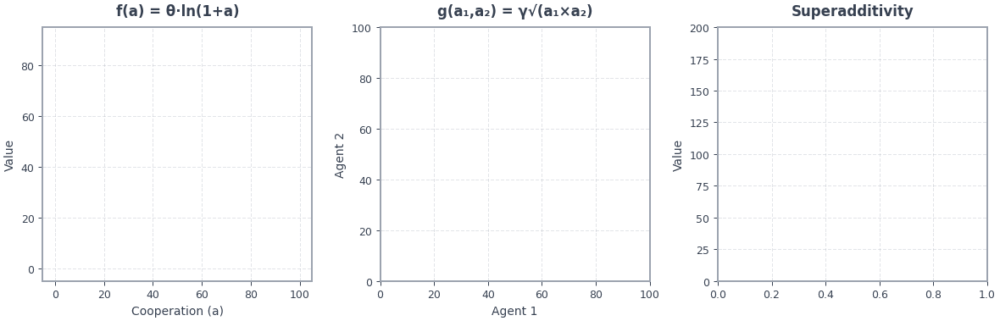
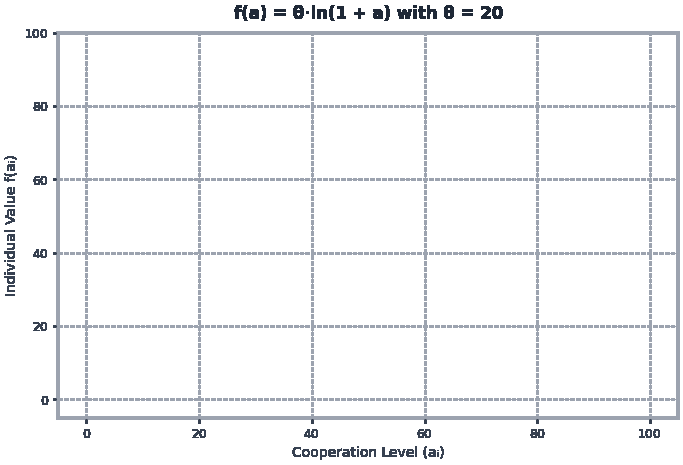

# Value Creation & Complementarity

**Formalizing Synergistic Value in Strategic Coopetition (TR-1)**

This document provides a comprehensive treatment of value creation and complementarity from Technical Report 1 (TR-2025-01), explaining how cooperative surplus emerges and is modeled mathematically.

---

## Value Creation at a Glance



*Left: Individual value function with diminishing returns. Center: Synergy heatmap showing value peaks at balanced contributions. Right: The green "Added Value" region shows superadditive gains from complementarity—17% extra value at equal contributions.*

---

## Executive Summary

**For Practitioners**: Complementarity explains *why* cooperation creates value—joint action produces more than the sum of independent efforts. When Samsung and Sony combined manufacturing expertise with brand strength, they created value neither could achieve alone.

**For Researchers**: We formalize complementarity through value creation functions V(a|γ) exhibiting superadditivity. Two specifications (logarithmic, power) are validated, with logarithmic achieving 58/60 accuracy on the S-LCD case study. The complementarity parameter γ controls synergy strength.

---

## Conceptual Foundation

### The Value Creation Problem

In coopetition, actors face a fundamental tension:

- **Cooperate** to create more total value (grow the pie)
- **Compete** to capture a larger share of that value (split the pie)

This is the essence of Brandenburger and Nalebuff's coopetition framework: actors must balance value creation incentives against value appropriation incentives.

### What is Complementarity?

**Definition**: Complementarity exists when joint action creates superadditive value—the whole exceeds the sum of the parts.

**Mathematically**:
```
V({i, j}) > V({i}) + V({j})
```

The value created by actors i and j working together exceeds what each could create independently.

### Sources of Complementarity

| Source | Mechanism | Example |
|--------|-----------|---------|
| **Resource Combination** | Heterogeneous assets synergize | Manufacturing + Brand |
| **Knowledge Spillovers** | Learning from partner | Technology transfer |
| **Network Effects** | Combined networks exceed sum | User base combination |
| **Risk Sharing** | Diversification benefits | Joint investment |
| **Economies of Scale** | Combined volume reduces cost | Joint purchasing |

### The Added Value Concept

Following Brandenburger and Nalebuff, we define an actor's **Added Value** as:

```
Added Value_i = V(all actors) - V(all actors except i)
```

Actors with high added value have strong bargaining positions because the coalition loses significant value without them. Complementarity increases added value for all participants.

---

## Mathematical Formalization

### The Value Creation Function

**Equation 2 (TR-1)**: Total value created by joint action:

```
V(a|γ) = Σ f_i(a_i) + γ × g(a_1, ..., a_N)
```

**Components**:

| Component | Symbol | Meaning |
|-----------|--------|---------|
| Individual Value | f_i(a_i) | Value actor i creates independently |
| Synergy Function | g(a_1,...,a_N) | Value existing only through collaboration |
| Complementarity | γ ∈ [0, 1] | Strength of synergistic effects |

### Individual Value Functions

Individual value represents what each actor contributes independently of collaboration. Two specifications are validated:

#### Logarithmic Specification (Recommended)

**Equation 6 (TR-1)**:
```
f_i(a_i) = θ × ln(1 + a_i)    where θ = 20.0
```

**Properties**:
- Strictly increasing: more action → more value
- Diminishing returns: first unit more valuable than last
- Bounded growth: prevents runaway predictions
- Initial slope = θ (steep initial returns)

**Graphical Intuition**:



*Logarithmic value function showing steep initial returns that flatten as cooperation increases—demonstrating diminishing marginal value.*

**When to Use**: Manufacturing partnerships, technology joint ventures, scenarios where baseline capabilities are highly valuable but incremental improvements have declining impact.

#### Power Specification (Alternative)

**Equation 3 (TR-1)**:
```
f_i(a_i) = a_i^β    where β = 0.75
```

**Properties**:
- Strictly increasing
- Diminishing returns (β < 1)
- Unbounded growth (can produce large values)
- Cobb-Douglas production function tradition

**When to Use**: General scenarios, platform ecosystems, academic baselines.

### Synergy Function

The synergy function captures value that exists *only* through collaboration—it requires multiple actors contributing.

**Equation 4 (TR-1)**: Geometric Mean

```
g(a_1, ..., a_N) = (a_1 × a_2 × ... × a_N)^(1/N)
```

**For Two Actors**:
```
g(a_1, a_2) = √(a_1 × a_2)
```

**Properties**:

| Property | Description | Implication |
|----------|-------------|-------------|
| Symmetric | Order doesn't matter | Fair contribution accounting |
| Zero-requiring | If any a_i = 0, g = 0 | All must contribute |
| Balance-rewarding | Maximized when a_i equal | Discourages free-riding |
| Smooth | Continuous and differentiable | Tractable optimization |

**Why Geometric Mean?**

The geometric mean captures the intuition that:
1. **Everyone must contribute**: A single defector (a_i = 0) destroys all synergy
2. **Balance matters**: 50-50 contribution creates more synergy than 90-10
3. **Scale invariance**: Synergy scales appropriately with contribution size

**Alternative Synergy Functions** (not implemented, for reference):

| Function | Formula | Properties |
|----------|---------|------------|
| Arithmetic Mean | Σa_i / N | Weak complementarity, tolerates defection |
| Minimum | min(a_i) | Leontief production, bottleneck-limited |
| Cobb-Douglas | ∏a_i^(α_i) | Asymmetric weights possible |

### The Complementarity Parameter (γ)

**Range**: γ ∈ [0, 1]

**Interpretation**:

| γ Value | Interpretation | Environment Behavior |
|---------|----------------|----------------------|
| 0.0 | No complementarity | Purely additive value; no synergy benefit |
| 0.3 | Weak complementarity | Modest cooperation incentive |
| 0.5 | Moderate complementarity | Balanced individual/joint value |
| 0.65 | **Validated default** | S-LCD case study calibration |
| 0.8 | Strong complementarity | Substantial cooperation incentive |
| 1.0 | Maximum complementarity | Synergy dominates individual value |

**Validated Value**: γ = 0.65 achieves optimal multi-criteria performance across experimental validation (TR-1 §7.2).

---

## Superadditivity Verification

### Proving Complementarity Creates Value

To verify that V(a|γ) exhibits superadditivity, consider two actors choosing actions (a_1, a_2).

**Joint Value** (power specification):
```
V({a_1, a_2}) = a_1^β + a_2^β + γ√(a_1 × a_2)
```

**Independent Values**:
```
V({a_1}) = a_1^β
V({a_2}) = a_2^β
```

**Superadditivity Condition**:
```
V({a_1, a_2}) > V({a_1}) + V({a_2})

⟺ a_1^β + a_2^β + γ√(a_1 × a_2) > a_1^β + a_2^β

⟺ γ√(a_1 × a_2) > 0
```

This holds for any γ > 0 and positive actions, confirming superadditivity. The synergy term γ√(a_1 × a_2) represents **Added Value** from collaboration.

### Quantifying Added Value

**Example**: Both actors invest 50 units, γ = 0.65, θ = 20

**Logarithmic Specification**:
```
Individual values:
  f_1(50) = 20 × ln(51) = 78.64
  f_2(50) = 20 × ln(51) = 78.64

Synergy:
  g(50, 50) = √(50 × 50) = 50
  Synergy value = 0.65 × 50 = 32.50

Total value:
  V = 78.64 + 78.64 + 32.50 = 189.78

Added Value from collaboration:
  189.78 - (78.64 + 78.64) = 32.50 (17% increase)
```

---

## Value Appropriation

### The Private Payoff Function

Value creation determines *how much* total value exists. Value appropriation determines *who gets it*.

**Equation 11 (TR-1)**:
```
π_i(a) = e_i - a_i + f_i(a_i) + α_i × [V(a) - Σf_j(a_j)]
```

**Components**:

| Term | Formula | Meaning |
|------|---------|---------|
| Endowment | e_i | Initial resources before interaction |
| Investment Cost | -a_i | Resources committed to partnership |
| Individual Return | f_i(a_i) | Return from own contribution |
| Synergy Share | α_i × Synergy | Share of collaborative surplus |

### Synergy = Collaborative Surplus

The synergy being divided is:
```
Synergy = V(a) - Σf_j(a_j) = γ × g(a_1, ..., a_N)
```

This is the **Added Value** from collaboration—value that exists only because actors worked together.

### Bargaining and Shares (α_i)

**Constraint**: Σα_i = 1 (all synergy must be allocated)

**Determination Methods**:

1. **Equal Shares**: α_i = 1/N (symmetric bargaining)
2. **Shapley Value**: α_i based on marginal contribution
3. **Nash Bargaining**: α_i reflects relative bargaining power
4. **Contractual**: Pre-negotiated based on relationship structure

**Connection to Interdependence**: Actors with strong bargaining positions (low dependency, high alternatives) typically secure larger α_i. See [Interdependence Framework](interdependence.md).

---

## Specification Comparison

### Experimental Validation

Both specifications were validated against the Samsung-Sony S-LCD joint venture (TR-1 §7-8):

| Criterion | Logarithmic (θ=20) | Power (β=0.75) | Winner |
|-----------|-------------------|----------------|--------|
| **Overall Validation** | 58/60 (96.7%) | 46/60 (76.7%) | Logarithmic |
| **Historical Alignment** | 16/16 | 12/16 | Logarithmic |
| **Cooperation Prediction** | 41% increase | 166% increase | Logarithmic |
| **Bounded Predictions** | Yes | No | Logarithmic |
| **Mathematical Tractability** | Moderate | High | Power |

### Why Logarithmic Wins Empirically

The logarithmic specification produces cooperation increases (41%) within the documented S-LCD range (15-50%), while the power specification produces increases (166%) exceeding realistic bounds.

**Key Insight**: The logarithmic function's bounded growth prevents runaway predictions that don't match real-world partnership dynamics.

### When to Use Each

| Scenario | Recommended | Rationale |
|----------|-------------|-----------|
| Manufacturing JV | Logarithmic | Bounded returns, validated |
| Technology partnership | Logarithmic | Diminishing returns realistic |
| Platform ecosystem | Either | Power may be simpler |
| Academic baseline | Power | Cobb-Douglas tradition |
| Sensitivity analysis | Both | Compare robustness |

---

## Implementation Details

### Code Correspondence

The value functions are implemented in `coopetition_gym/core/value_functions.py`:

```python
# Logarithmic individual value
def logarithmic_individual_value(action, theta=20.0):
    return theta * np.log(1 + action)

# Power individual value
def power_individual_value(action, beta=0.75):
    return action ** beta

# Geometric mean synergy
def geometric_mean_synergy(actions):
    return np.prod(actions) ** (1 / len(actions))

# Total value
def total_value(actions, gamma=0.65, theta=20.0):
    individual = sum(logarithmic_individual_value(a, theta) for a in actions)
    synergy = gamma * geometric_mean_synergy(actions)
    return individual + synergy
```

### Parameter Configuration

```python
import coopetition_gym

# Using logarithmic specification (default)
env = coopetition_gym.make("TrustDilemma-v0",
    theta=20.0,      # Logarithmic scale
    gamma=0.65,      # Complementarity
)

# Using power specification
env = coopetition_gym.make("TrustDilemma-v0",
    value_spec="power",
    beta=0.75,       # Power exponent
    gamma=0.65,      # Complementarity
)
```

---

## Equilibrium Implications

### How Complementarity Affects Equilibrium

Higher γ (more complementarity) shifts equilibrium toward:
- **More cooperation**: Larger synergy rewards joint action
- **Higher total value**: More surplus to divide
- **Mutual benefit**: Both actors gain from cooperation

### Complementarity and Trust

Complementarity interacts with trust dynamics (TR-2):

1. High γ creates incentive to cooperate → builds trust
2. Built trust enables more cooperation → realizes synergy
3. Realized synergy reinforces cooperative equilibrium

This creates a **virtuous cycle** when γ is high and a **vicious cycle** when γ is low.

### Benchmark Evidence

From 760 experiments (76,000 episodes):

| γ Level | Mean Cooperation | Mean Trust | Mean Return |
|---------|------------------|------------|-------------|
| 0.50 | 42.3% | 41.8% | 34,521 |
| 0.65 | 52.1% | 54.3% | 47,832 |
| 0.80 | 61.4% | 67.2% | 58,947 |

**Insight**: Higher complementarity produces more cooperative outcomes, higher trust, and higher returns.

---

## Practical Applications

### For Partnership Design

- **Identify Complementary Assets**: What unique capabilities does each partner bring?
- **Quantify Synergy Potential**: Estimate γ based on asset complementarity
- **Structure Value Sharing**: Set α_i to sustain cooperation incentives

### For Environment Customization

```python
# High-complementarity scenario (technology partnership)
high_comp_env = coopetition_gym.make("TrustDilemma-v0",
    gamma=0.80,  # Strong synergy
    theta=25.0,  # Higher value scale
)

# Low-complementarity scenario (commodity market)
low_comp_env = coopetition_gym.make("TrustDilemma-v0",
    gamma=0.35,  # Weak synergy
    theta=15.0,  # Lower value scale
)
```

### For Research

- **Complementarity Effects**: How does γ affect algorithm performance?
- **Value Function Comparison**: Do results differ across specifications?
- **Synergy Discovery**: Can algorithms find cooperative equilibria?

---

## Further Reading

### Primary Source
- Pant, V. & Yu, E. (2025). Computational Foundations for Strategic Coopetition: Formalizing Interdependence and Complementarity. *arXiv:2510.18802*, Sections 4.2-4.3, 7

### Background
- Brandenburger, A. & Nalebuff, B. (1996). Co-opetition. *Currency Doubleday*
- Shapley, L. (1953). A Value for n-Person Games. *Contributions to the Theory of Games*

### Related Theory Documents
- [Interdependence Framework](interdependence.md)
- [Trust Dynamics](trust_dynamics.md)
- [Parameter Reference](parameters.md)

---

## Navigation

- [Theoretical Foundations](index.md)
- [Interdependence Framework](interdependence.md)
- [Trust Dynamics](trust_dynamics.md)
- [Parameter Reference](parameters.md)
- [Environment Reference](../environments/index.md)
